# 1 - Fondamenti di informatica e primo programma

Ing. Giancarlo Degani

---

# Il corso

- **Programma:**
  - Prima parte: cultura informatica
  - Seconda parte: programmazione in linguaggio 'C'
- **Durata:** 30 ore (7 lezioni da 4 ore e 1 da 2 ore)
- **Verifica:** test finale di 20 domande a risposta multipla
  - 10 domande di teoria: 1 punto ciascuna
  - 10 domande su un esempio di codice da interpretare: 2 punti ciascuna
- **Dopo il corso:** modulo "Programmazione assistita dall'AI" (16 ore)

---

# Strumenti

- Dispense delle lezioni
- Classroom
- CLion

---
layout: image-right
image: /clion1.png

---

# CLion

- [CLion Download](https://www.jetbrains.com/clion/)
- [Educational license](https://www.jetbrains.com/community/education/#students/)

---
layout: image-right
image: /clion_license.png

---

# Licenza per STUDENTI

- Creare un account con l’email **@itsmeccatronico.it** e richiedere una licenza educational
- Scaricare ed installare CLion
- Aprire il programma e registrare la licenza inserendo le credenziali dell’account in **Help > Register**
- <https://www.jetbrains.com>

---

# Riferimenti

- <https://cppreference.com/w/c.html>
- <https://en.wikibooks.org/wiki/C_Programming>
- <https://archive.org/details/Apress.Beginning.C.5th.Edition.2013>

---
hide: true
layout: quote

---

# quote

<br>
<br>
<br>
“Algoritmi + Strutture Dati = Programmi”

*Niklaus Wirth*

---

# Pair Programming

**Tecnica collaborativa di sviluppo software**

Due programmatori lavorano insieme allo stesso computer per scrivere codice.

**Vantaggi:**

- Qualità del codice superiore (revisione continua)
- Apprendimento reciproco e condivisione di conoscenze
- Meno errori e bug
- Problem solving più veloce
- Maggiore concentrazione

**Durante le esercitazioni in aula lavorerete in coppia seguendo questa metodologia.**

---

# Pair Programming: Driver e Navigator

## 🖥️ Driver (Pilota)

**Chi siede davanti al computer**

- Scrive il codice alla tastiera
- Si concentra sulla sintassi e sui dettagli tecnici
- Implementa ciò che viene discusso
- **Focus tattico**: come scrivere il codice

---

# Pair Programming: Driver e Navigator

## 🧭 Navigator (Navigatore)

**Chi guida e supervisiona**

- Pensa alla strategia generale e all'architettura
- Rivede il codice in tempo reale
- Suggerisce miglioramenti e alternative
- Anticipa problemi e casi limite
- **Focus strategico**: cosa scrivere e perché

**⏱️ Importante:** Scambiatevi i ruoli ogni 15-20 minuti!

---

# ALGORITMO

- Il termine deriva dalla trascrizione latina del nome del matematico persiano al-Khwarizmi, vissuto nel IX secolo d.C. È considerato uno dei primi autori ad aver fatto riferimento a questo concetto, scrivendo il libro “Regole di ripristino e riduzione”.
- In matematica e informatica, un algoritmo è la specificazione di una sequenza finita di operazioni (dette anche istruzioni) che consente di risolvere una classe di problemi specifici o di calcolare il risultato di un'espressione matematica.

---

# Proprietà di un algoritmo

- **Finito:** costituito da un numero finito di istruzioni.
- **Deterministico:** partendo dagli stessi dati di ingresso, ottengo gli stessi risultati.
- **Generale:** applicabile a tutti i problemi della classe a cui si riferisce.
  - Ad esempio, l'algoritmo per il calcolo dell'area di un rettangolo deve essere applicabile a tutti i rettangoli.
- **Eseguibile:** esiste un esecutore in grado di eseguire tutte le istruzioni in un tempo finito.

---
layout: image-right
image: /human_computer.png

---

# Caratteristiche degli Esecutori

- Il linguaggio che possono comprendere (italiano, inglese, C, TypeScript, ecc.)
- Le azioni che possono eseguire
- Le regole che associano alle istruzioni fornite le azioni da eseguire

---

# Calcolatore COME ESECUTORE

<br>
<br>
<br>
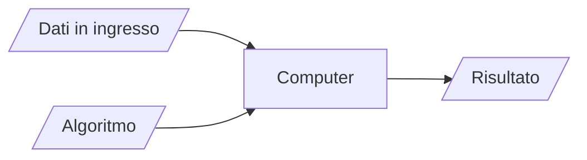

---

# ESEMPIO

<br>
<br>
<br>
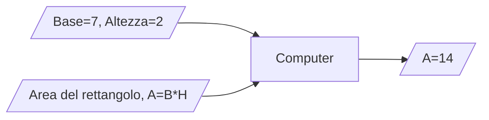

---

# STRUTTURE DATI

- I contenitori usati per contenere i dati in ingresso sono detti variabili.
- Le variabili:
  - Hanno un nome o identificatore.
  - Possono essere usate come parte di una istruzione.
  - Possono essere caratterizzate dal tipo di dato che contengono
    - es. variabili per numeri interi, numeri reali, sequenze di numeri, etc...

---

# ISTRUZIONI DI ASSEGNAZIONE

- Consentono di inserire un valore all’interno di una variabile.
- Cambiano a seconda del linguaggio utilizzato, ma solitamente usano l’operatore “=”.
  - x=5 assegna il valore 5 alla variabile x.
  - y=x assegna il valore contenuto nella variabile x alla variabile y.

---

# ESPRESSIONI ARITMETICHE

Sono costituite da:

- Operandi: variabili, costanti, espressioni aritmetiche
- Operatori: addizione ‘+’, sottrazione ‘-‘, moltiplicazione ‘*’, divisione intera ‘/‘, resto o modulo ‘%’
- Parentesi: per definire l’ordine con cui vengono elaborate
- Risultato: un numero

---

# ESEMPI

|||
|:---|:---|
| X = 5 |Assegna alla variabile x il valore 5|
|X = 5+3|Assegna ad x il valore 8|
|Y = 5%3|Assegna ad y il valore 2|
|X = X *3|Assegna ad x il valore precedente moltiplicato per 3|

---

# ESPRESSIONI RELAZIONALI

Sono costituite da:

- Operandi: variabili, costanti, espressioni.
- Operatori: uguaglianza ==, disuguaglianza !=, maggiore di >, minore di <.
- Parentesi: per definire l’ordine con cui vengono elaborate.
- Risultato: vero o falso.

---

# ESEMPI

|||
|:---|:---|
|X = 5|Assegna alla variabile x il valore 5|
|X == 5|Vero|
|X != 5|Falso|
|X > 0|Vero|

---

# ESPRESSIONI LOGICHE

Sono costituite da:

- Operandi: variabili, costanti, espressioni
- Operatori: somma logica (OR), moltiplicazione logica (AND), negazione (NOT)
- Parentesi: per definire l’ordine con cui vengono elaborate
- Risultato: un valore logico, vero o falso

---
layout: two-cols-header

---

# Operatori logici

::left::

## Negazione

|A|**NOT** A|
|---|---|
|0|1|
|1|0|

::right::

## Moltiplicazione

|A|B|A **AND** B|
|---|---|---|
|0|0|0|
|0|1|0|
|1|0|0|
|1|1|1|

---
layout: two-cols-header

---

# Operatori logici

::left::

## Somma

|A|B|A **OR** B|
|---|---|---|
|0|0|0|
|0|1|1|
|1|0|1|
|1|1|1|

::right::

## Disuguaglianza

|A|B|A **XOR** B|
|---|---|---|
|0|0|0|
|0|1|1|
|1|0|1|
|1|1|0|

---

# DIAGRAMMA DI FLUSSO/FLOW CHART

- Consentono di rappresentare visivamente un algoritmo.
- Sono indipendenti dal linguaggio di programmazione.
- Esistono diversi standard grafici.

---
layout: image
image: /flowchart.png
backgroundSize: contain
title: Simboli flowchart

---

---

# Esempio di flowchart

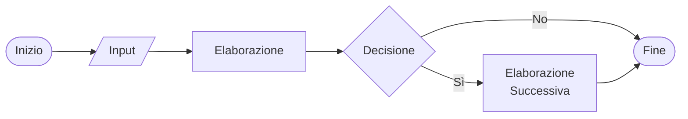

---
layout: two-cols

---

# Esempio: area di un rettangolo

- Calcolo dell’area di un rettangolo
- Input: base ed altezza
- Algoritmo: Area = base * altezza

::right::

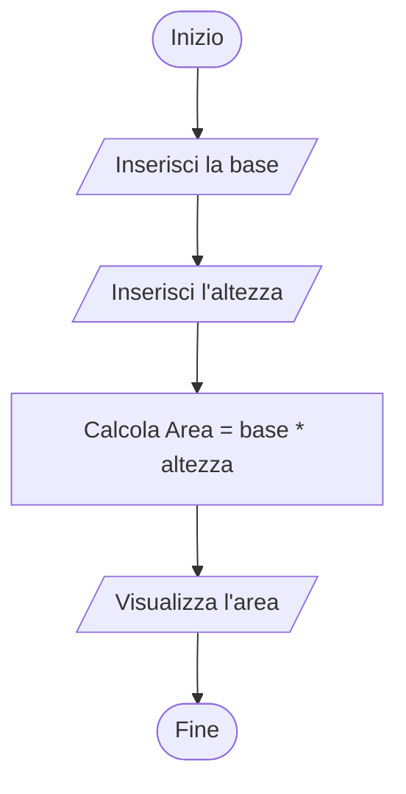

---
layout: two-cols

---

# Selezione - IF THEN ELSE

- Viene valutata una condizione.
- Se la condizione è vera, l’elaborazione prosegue con il ramo di sinistra.
- Se la condizione è falsa, l’elaborazione prosegue con il ramo di destra.

::right::

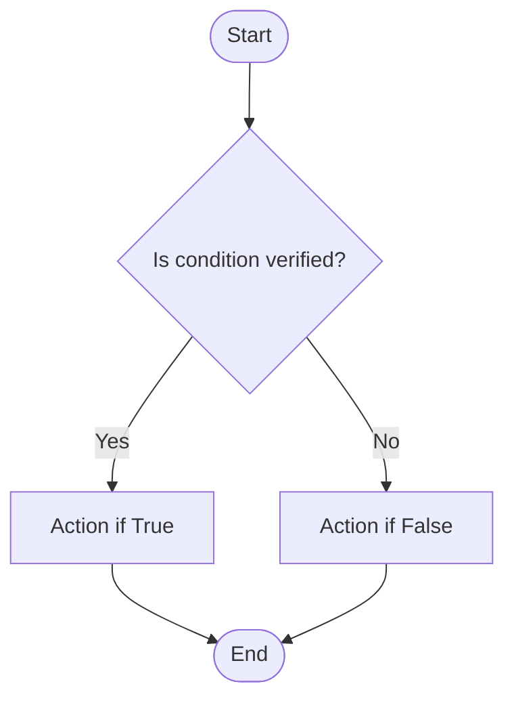

---
layout: two-cols

---

# Ciclo While

- Viene valutata una condizione.
- Se la condizione è vera, viene eseguita l’azione e poi viene rivalutata la condizione.
- Si esce dal ciclo quando la condizione diventa falsa.

::right::

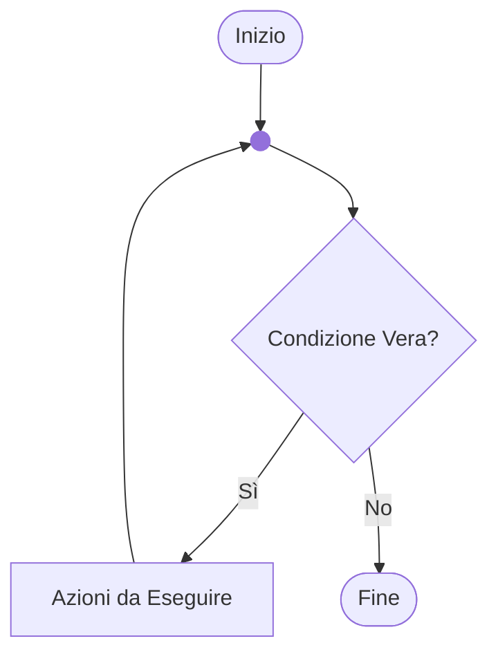

---
layout: two-cols

---

# Ciclo do while

- Viene eseguita l’azione.
- Se la condizione è vera, l’azione viene eseguita nuovamente e poi viene rivalutata la condizione.
- Si esce dal ciclo quando la condizione diventa falsa.
- Nel ciclo do-while l’azione viene eseguita almeno una volta.

::right::

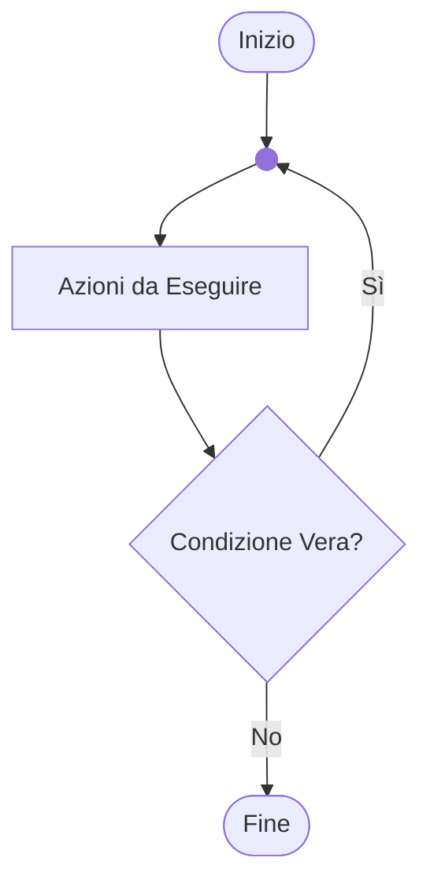

---
layout: two-cols

---

# Ciclo for

- Viene valutata la condizione e, se vera, si esegue l’azione.
- L’azione viene eseguita un numero finito di volte.

::right::

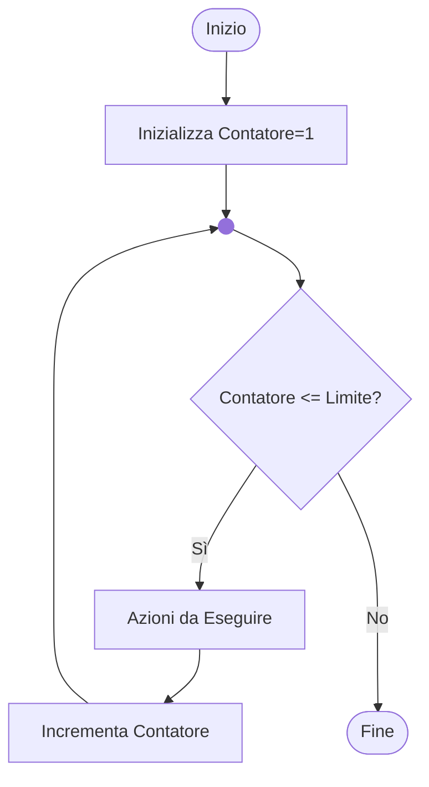

---
layout: two-cols

---

# Esempio: CALCOLO DEL FATTORIALE

Dato un numero intero, calcolarne il fattoriale.

- Input: un numero intero maggiore o uguale a zero
- Algoritmo: moltiplico n per tutti i numeri minori di n, fino a 2

::right::

<br>
<br>
<br>
<br>
<br>
<br>
<br>
$$
n! =
\begin{cases}
1 & \text{se } n = 0 \\
n \times (n-1) \times \cdots \times 2 \times 1 & \text{se } n > 0
\end{cases}
$$

---

# Esempio: CALCOLO DEL FATTORIALE

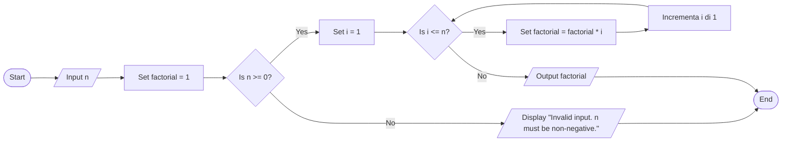

---

# Esempio: CALCOLO DEL FATTORIALE

<div class="absolute right-30px bottom-30px">

</div>

---

# ESERCIZIO

Rappresentare un algoritmo per il calcolo del costo di un prodotto che soddisfi i seguenti requisiti:

- Input: costo unitario, quantità acquistata
- Se il numero di elementi acquistati è superiore a 10, applicare uno sconto del 20%
- Output: costo totale

---
layout: two-cols

---

# flow-chart

Flowchart della soluzione

::right::

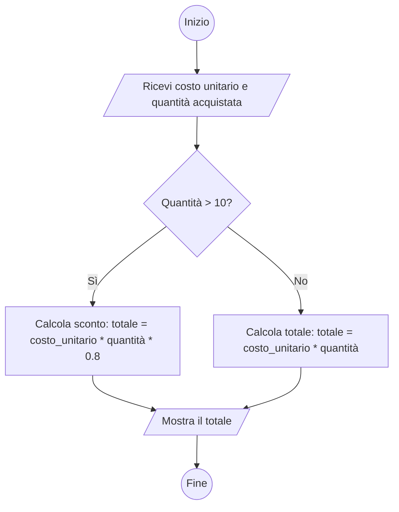

---

# ESERCIZIO

Rappresentare un algoritmo per il calcolo della potenza n-esima di un numero intero che soddisfi i seguenti requisiti:

- Input: numero, potenza
- Output: numero^potenza
- Usare solo le operazioni elementari: +, -, *, /

---
layout: two-cols

---

# flow-chart

Flowchart della soluzione

::right::

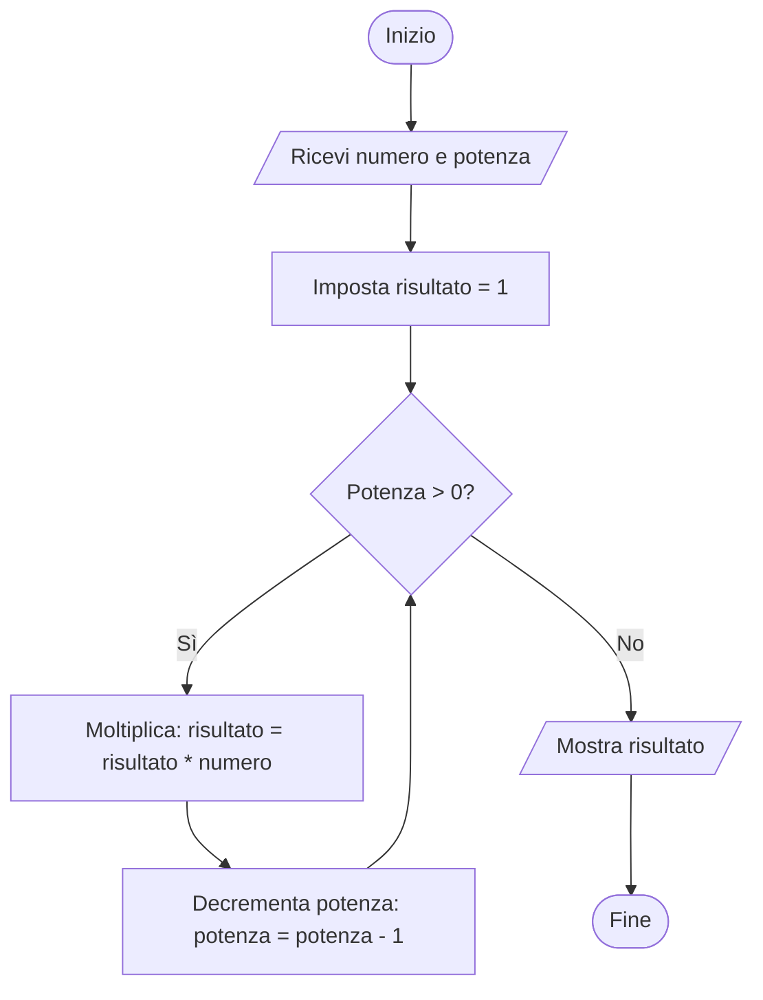

---
layout: center

---

# “Algoritmi + Strutture Dati = Programmi”

## Niklaus Wirth

---

# Programmazione

- Il programma è una sequenza di istruzioni che produce un obiettivo desiderato in un tempo finito, implementando un algoritmo.
- La programmazione è il processo che porta alla realizzazione di un programma o software.

---
layout: image-right
image: /pancake.png

---

# Ricetta

- Input:
  - Lista di ingredienti
  - Procedimento da eseguire
- Output:
  - Pancake

---

# Problema

- Per fornire istruzioni a un computer è necessario utilizzare un linguaggio comune.
- Il computer comprende solo sequenze di 0 e 1, ovvero sequenze binarie.
- Il programmatore comprende il linguaggio naturale: “fai, leggi, scrivi.”

---

# Programma

- Il computer mette a disposizione delle istruzioni elementari.
- Il programma è una sequenza di istruzioni elementari scritta da un programmatore per risolvere un problema.
- Il programmatore utilizza un linguaggio di programmazione per fornire la sequenza di istruzioni al computer, ovvero per scrivere il programma.
- Il linguaggio di programmazione è un linguaggio compreso sia dal computer che dal programmatore.

---

# Traduttori in linguaggio macchina

- Interprete: Le istruzioni vengono tradotte una alla volta ed eseguite immediatamente dal calcolatore.
- Compilatore: Tutte le istruzioni vengono tradotte in linguaggio macchina e memorizzate in un file eseguibile dal calcolatore (programma).

---

# Pro e contro

Velocità di esecuzione:

- L’interprete deve tradurre il programma ogni volta che lo esegue.
- Il programma compilato viene tradotto solo una volta.
- Il compilatore è più efficiente ed ottimizza il codice tradotto.

---

# Pro e contro

Prerequisiti:

- L’interprete deve essere installato su ogni macchina che userà il programma.
- Il compilatore viene acquistato ed usato solo dal programmatore.

---

# Pro e contro

Proprietà intellettuale:

- L’interprete richiede la distribuzione del codice sorgente in chiaro.
- Il programma compilato può essere distribuito in linguaggio macchina, senza il codice sorgente.

---

# Linguaggi di programmazione

Calcolatore e programmatore, per comprendersi, devono avere un linguaggio comune:

- Linguaggi a basso livello: (es. Assembly)
- Linguaggi ad alto livello: (es. JavaScript, Python)
- Linguaggi compilati: (es. TypeScript, Java)
- Linguaggi interpretati: (es. JavaScript, Python)

Il documento contenente le istruzioni scritte in un linguaggio di programmazione si chiama **codice sorgente**.

---
layout: image-right
image: /binary.png

---

# Linguaggio macchina

Sequenza binaria comprensibile solo da uno specifico microprocessore o da una famiglia di microprocessori.

---
layout: two-cols

---

# Linguaggio assembly

Stampa la scritta “hello world” in linguaggio assembly per microprocessore Intel 8086.

::right::

<<< @/snippets/example00/HelloWorld.asm asm {all}{lines:true}

---
layout: two-cols

---

# Linguaggio C

Stampa la scritta “hello world”.

::right::

<<< @/snippets/example01/main.c c {all}{lines:true}

---
layout: two-cols

---

# Linguaggio Python

Stampa la scritta “hello world” in Python.

::right::

<<< @/snippets/example00/hello.py py {all}{lines:true}

---
layout: image-right
image: /kernighan.png

---

# Il linguaggio C

- Sviluppato da Dennis Ritchie ai Bell Labs nel 1972 per realizzare il sistema operativo UNIX
- Linguaggio compilato
- Compilatore disponibile per tutte le piattaforme
- Codice molto efficiente

---

# Il linguaggio C, caratteristiche

- Adatto sia come linguaggio ad alto livello che a basso livello (operazioni sui bit)
- Tantissime librerie disponibili
- Linguaggio procedurale, non ad oggetti (Aggiunti nel C++)
- Gestione della memoria “manuale” (Non c’è garbage collector)

---

# Librerie

- In un linguaggio ad alto livello le funzioni di base sono fornite dal linguaggio ( lettura da tastiera, scrittura su schermo, lettura/scrittura da file)
- Queste operazioni elementari sono disponibili sotto forma di funzioni
- Le funzioni sono raccolte e distribuite sotto forma di librerie

---

# Come si scrive un programma?

- Bastano un editor di testo per scrivere il file sorgente ed un compilatore o interprete per tradurre il sorgente in linguaggio macchina
- Solitamente si usa uno strumento definito Integrated Development Environment (IDE)
- CLion è un IDE specifico per C/C++

---

# hello, world

<<< @/snippets/example01/main.c txt {all}{lines:true}

---

# hello, world

<<< @/snippets/example01/main.c c {all|1-4|6-7|9-15|17-18|19|all}{lines:true}

---

# Input/Output: printf()

`printf()` stampa testo formattato sullo standard output (terminale):

**Sintassi:**

```c
printf("formato", argomenti...);
```

**Specificatori di formato:**

| Specificatore | Tipo | Esempio |
|---------------|------|---------|
| `%d` o `%i` | int | `printf("%d", 42);` → `42` |
| `%f` | float/double | `printf("%f", 3.14);` → `3.140000` |
| `%c` | char | `printf("%c", 'A');` → `A` |
| `%s` | stringa | `printf("%s", "Hello");` → `Hello` |
| `%lf` | double (con scanf) | `scanf("%lf", &d);` |
| `%%` | Carattere % | `printf("%%");` → `%` |

---

# printf(): esempi

```c
#include <stdio.h>

int main(void) {
    int age = 25;
    float height = 1.75;
    char grade = 'A';
    
    // Stampa semplice
    printf("Hello, World!\n");
    
    // Stampa con variabili
    printf("Age: %d\n", age);                    // Age: 25
    printf("Height: %f\n", height);              // Height: 1.750000
    printf("Grade: %c\n", grade);                // Grade: A
    
    // Formattazione decimali
    printf("Height: %.2f\n", height);            // Height: 1.75
    
    // Multipli argomenti
    printf("Age: %d, Height: %.2f, Grade: %c\n", age, height, grade);
    
    return 0;
}
```

---

# printf(): controllo formato

**Larghezza campo:**

```c
int x = 42;
printf("%5d\n", x);     //    42 (5 caratteri, allineato a destra)
printf("%-5d\n", x);    // 42    (5 caratteri, allineato a sinistra)
```

**Precisione decimali:**

```c
float pi = 3.14159265;
printf("%.2f\n", pi);   // 3.14 (2 decimali)
printf("%.4f\n", pi);   // 3.1416 (4 decimali, arrotonda!)
printf("%8.2f\n", pi);  //     3.14 (8 caratteri totali, 2 decimali)
```

**Caratteri speciali:**

```c
printf("Line 1\nLine 2\n");     // \n = newline
printf("Tab\there\n");          // \t = tab
printf("Quote: \"\n");          // \" = virgolette
printf("Backslash: \\\n");      // \\ = backslash
```

---

# Esercizio: Il tuo primo programma in CLion (parte 1)

**Obiettivo:** Creare ed eseguire il programma "Hello, World!" usando CLion

**Passi da seguire:**

1. Apri CLion
2. Crea un nuovo progetto: `File → New Project`
3. Seleziona **C Executable**
4. Imposta le seguenti opzioni:
   - Nome progetto: `hello_world`
   - Linguaggio: **C**
   - Standard: **C11**
5. Clicca su **Create**

---

# Esercizio: Il tuo primo programma in CLion (parte 2)

6. Verifica che il file `main.c` contenga il codice Hello World
7. Clicca sul pulsante ▶️ verde (Run) oppure premi `Shift+F10` (Windows/Linux) o `Ctrl+R` (macOS)
8. Verifica l'output nella finestra **Run** in basso

**Risultato atteso nella console:**

```text
Hello, World!

Process finished with exit code 0
```
