```mermaid {scale: 1, alt: 'A diagram'}
flowchart TD
    J1@{ shape: f-circ, label: ""}
    Start([Inizio]) --> J1
    J1 --> Controllo{Condizione Vera?}
    Controllo -- Sì --> Azione[Azioni da Eseguire]
    Azione --> J1
    Controllo -- No --> End([Fine])
```

```mermaid {scale: 0.9, alt: 'A diagram'}
flowchart TD
    J1@{ shape: f-circ, label: ""}
    Start([Inizio]) --> J1
    J1 --> Azione[Azioni da Eseguire]
    Azione --> Controllo{Condizione Vera?}
    Controllo -- Sì --> J1
    Controllo -- No --> End([Fine])
```

```mermaid {scale: 0.7, alt: 'A diagram'}
flowchart TD
    A((Inizio)) --> B[/Ricevi costo unitario e quantità acquistata/]
    B --> C{Quantità > 10?}
    C -->|Sì| D[Calcola sconto: totale = costo_unitario * quantità * 0.8]
    C -->|No| E[Calcola totale: totale = costo_unitario * quantità]
    D --> F[/Mostra il totale/]
    E --> F
    F --> G((Fine))
```

---

layout: cover
coverDate:
---

# 1 - Fondamenti di Informatica

Ing. Giancarlo Degani

---
level: 3

---

# Il corso

- **Programma:**
  - Prima parte: cultura informatica
  - Seconda parte: programmazione in linguaggio 'C'
- **Durata:** 30 ore
- **Verifica:** test finale con domande a risposta multipla

---
level: 3

---

# Strumenti

- Dispense delle lezioni
- Classroom
- CLion

---
layout: image-right

image: /clion1.png

level: 3

---

# CLion

- [CLion Download](https://www.jetbrains.com/clion/)
- [Educational license](https://www.jetbrains.com/community/education/#students/)

---
layout: image-right
image: /clion_license.png
level: 3

---

# Licenza per STUDENTI

- Creare un account con l’email **@itsmeccatronico.it** e richiedere una licenza educational
- Scaricare ed installare CLion
- Aprire il programma e registrare la licenza inserendo le credenziali dell’account in **Help > Register**

---
level: 3

---

# Riferimenti

- <https://cplusplus.com/reference/clibrary/>
- <https://en.wikibooks.org/wiki/C_Programming>
- <https://archive.org/details/Apress.Beginning.C.5th.Edition.2013>

---
hide: true
layout: quote

level: 3

---

# quote

 
 
 
“Algoritmi + Strutture Dati = Programmi”

*Niklaus Wirth*

---
level: 3

---

# ALGORITMO

- Il termine deriva dalla trascrizione latina del nome del matematico persiano al-Khwarizmi, vissuto nel IX secolo d.C. È considerato uno dei primi autori ad aver fatto riferimento a questo concetto, scrivendo il libro “Regole di ripristino e riduzione”.
- In matematica e informatica, un algoritmo è la specificazione di una sequenza finita di operazioni (dette anche istruzioni) che consente di risolvere una classe di problemi specifici o di calcolare il risultato di un'espressione matematica.

---
level: 3

---

# Proprietà di un algoritmo

- **Finito:** costituito da un numero finito di istruzioni.
- **Deterministico:** partendo dagli stessi dati di ingresso, ottengo gli stessi risultati.
- **Generale:** applicabile a tutti i problemi della classe a cui si riferisce.
  - Ad esempio, l'algoritmo per il calcolo dell'area di un rettangolo deve essere applicabile a tutti i rettangoli.
- **Eseguibile:** esiste un esecutore in grado di eseguire tutte le istruzioni in un tempo finito.

---
layout: image-right
image: /human_computer.png
level: 3

---

# Caratteristiche degli Esecutori

- Il linguaggio che possono comprendere (italiano, inglese, C, TypeScript, ecc.)
- Le azioni che possono eseguire
- Le regole che associano alle istruzioni fornite le azioni da eseguire

---
level: 3

---

# Calcolatore COME ESECUTORE

 
 
 

---
level: 3

---

# ESEMPIO

 
 
 

---
level: 3

---

# STRUTTURE DATI

- I contenitori usati per contenere i dati in ingresso sono detti variabili.
- Le variabili:
  - Hanno un nome o identificatore.
  - Possono essere usate come parte di una istruzione.
  - Possono essere caratterizzate dal tipo di dato che contengono
    - es. variabili per numeri interi, numeri reali, sequenze di numeri, etc...

---
level: 3

---

# ISTRUZIONI DI ASSEGNAZIONE

- Consentono di inserire un valore all’interno di una variabile.
- Cambiano a seconda del linguaggio utilizzato, ma solitamente usano l’operatore “=”.
  - x=5 assegna il valore 5 alla variabile x.
  - y=x assegna il valore contenuto nella variabile x alla variabile y.

---
level: 3

---

# ESPRESSIONI ARITMETICHE

Sono costituite da:

- Operandi: variabili, costanti, espressioni aritmetiche
- Operatori: addizione ‘+’, sottrazione ‘-‘, moltiplicazione ‘*’, divisione intera ‘/‘, resto o modulo ‘%’
- Parentesi: per definire l’ordine con cui vengono elaborate
- Risultato: un numero

---
level: 3

---

# ESEMPI

|||
|:---|:---|
| X = 5 |Assegna alla variabile x il valore 5|
|X = 5+3|Assegna ad x il valore 8|
|Y = 5%3|Assegna ad y il valore 2|
|X = X *3|Assegna ad x il valore precedente moltiplicato per 3|

---
level: 3

---

# ESPRESSIONI RELAZIONALI

Sono costituite da:

- Operandi: variabili, costanti, espressioni.
- Operatori: uguaglianza ==, disuguaglianza !=, maggiore di >, minore di <.
- Parentesi: per definire l’ordine con cui vengono elaborate.
- Risultato: vero o falso.

---
level: 3

---

# ESEMPI

|||
|:---|:---|
|X = 5|Assegna alla variabile x il valore 5|
|X == 5|Vero|
|X != 5|Falso|
|X > 0|Vero|

---
level: 3

---

# ESPRESSIONI LOGICHE

Sono costituite da:

- Operandi: variabili, costanti, espressioni
- Operatori: somma logica (OR), moltiplicazione logica (AND), negazione (NOT)
- Parentesi: per definire l’ordine con cui vengono elaborate
- Risultato: un valore logico, vero o falso

---
layout: two-cols-header
level: 3

---

# Operatori logici

::left::

## Negazione

|A|**NOT** A|
|---|---|
|0|1|
|1|0|

::right::

## Moltiplicazione

|A|B|A **AND** B|
|---|---|---|
|0|0|0|
|0|1|0|
|1|0|0|
|1|1|1|

---
layout: two-cols-header
level: 3

---

# Operatori logici

::left::

## Somma

|A|B|A **OR** B|
|---|---|---|
|0|0|0|
|0|1|1|
|1|0|1|
|1|1|1|

::right::

## Disuguaglianza

|A|B|A **XOR** B|
|---|---|---|
|0|0|0|
|0|1|1|
|1|0|1|
|1|1|0|

---
level: 3

---

# DIAGRAMMA DI FLUSSO/FLOW CHART

- Consentono di rappresentare visivamente un algoritmo.
- Sono indipendenti dal linguaggio di programmazione.
- Esistono diversi standard grafici.

---
layout: image

image: /flowchart.png

backgroundSize: contain

title: Simboli flowchart

level: 3

---

---
level: 3

---

# Esempio di flowchart

---
layout: two-cols

level: 3

---

# Esempio: area di un rettangolo

- Calcolo dell’area di un rettangolo
- Input: base ed altezza
- Algoritmo: Area = base * altezza

::right::

---
layout: two-cols

level: 3

---

# Selezione - IF THEN ELSE

- Viene valutata una condizione.
- Se la condizione è vera, l’elaborazione prosegue con il ramo di sinistra.
- Se la condizione è falsa, l’elaborazione prosegue con il ramo di destra.

::right::

---
layout: two-cols

level: 3

---

# Ciclo While

- Viene valutata una condizione.
- Se la condizione è vera, viene eseguita l’azione e poi viene rivalutata la condizione.
- Si esce dal ciclo quando la condizione diventa falsa.

::right::

---
layout: two-cols

level: 3

---

# Ciclo do while

- Viene eseguita l’azione.
- Se la condizione è vera, l’azione viene eseguita nuovamente e poi viene rivalutata la condizione.
- Si esce dal ciclo quando la condizione diventa falsa.
- Nel ciclo do-while l’azione viene eseguita almeno una volta.

::right::

---
layout: two-cols

level: 3

---

# Ciclo for

- Viene valutata la condizione e, se vera, si esegue l’azione.
- L’azione viene eseguita un numero finito di volte.

::right::

---
layout: two-cols

level: 3

---

# Esempio: CALCOLO DEL FATTORIALE

Dato un numero intero, calcolarne il fattoriale.

- Input: un numero intero maggiore o uguale a zero
- Algoritmo: moltiplico n per tutti i numeri minori di n, fino a 2

::right::

 
 
 
 
 
 
 
$$
n! =
\begin{cases}
1 & \text{se } n = 0 \\
n \times (n-1) \times \cdots \times 2 \times 1 & \text{se } n > 0
\end{cases}
$$

---
level: 3

---

# Esempio: CALCOLO DEL FATTORIALE

---
level: 3

---

# Esempio: CALCOLO DEL FATTORIALE

---
level: 3
---

# ESERCIZIO

Rappresentare un algoritmo per il calcolo del costo di un prodotto che soddisfi i seguenti requisiti:

- Input: costo unitario, quantità acquistata
- Se il numero di elementi acquistati è superiore a 10, applicare uno sconto del 20%
- Output: costo totale

---
layout: two-cols

level: 3

---

# flow-chart

Flowchart della soluzione

::right::

---
level: 3

---

# ESERCIZIO

Rappresentare un algoritmo per il calcolo della potenza n-esima di un numero intero che soddisfi i seguenti requisiti:

- Input: numero, potenza
- Output: numero^potenza
- Usare solo le operazioni elementari: +, -, *, /

---
layout: two-cols
level: 3

---

# flow-chart

Flowchart della soluzione

::right::

---
level: 3

---

# Codifiche numeriche

|Sistema|Base|Simboli|
|---|---|---|
|Binario|2|\{0,1\}|
|Ottale|8|\{0,1,2,3,4,5,6,7\}|
|Decimale|10|\{0,1,2,3,4,5,6,7,8,9\}|
|Esadecimale|16|\{0,1,2,3,4,5,6,7,8,9,A,B,C,D,E,F\}|

---
level: 3

---

# Esempi

|Decimale|Binario|Esadecimale|
|---|---|---|
|2|10|2|
|10|1010|A|
|16|1 0000|10|
|255|1111 1111|FF|

---
level: 3

---

# Codifica numerica posizionale

 

$$
n = \sum_{\substack{0 < i < m}} r_j \cdot b^j
$$

$$
1024 = 1 \times 10^3 + 0 \times 10^2 + 2 \times 10^1 + 4 \times 10^0 = 1024_{10}
$$

 

$$
10 = 1 \times 2^3 + 0 \times 2^2 + 1 \times 2^1 + 0 \times 2^0 = 1010_2
$$

 

$$
1024_{10} = 1 \times 2^{10} + 0 \times 2^9 + 0 \times 2^8 + 0 \times 2^7 + 0 \times 2^6 + 0 \times 2^5
\\+ 0 \times 2^4 + 0 \times 2^3 + 0 \times 2^2 + 0 \times 2^1 + 0 \times 2^0 = 100 0000 0000_2
$$

---
layout: two-cols

level: 3

---

# Conversione IN BINARIO

- Per convertire un numero da base decimale a base binaria si utilizzano le operazioni di divisione intera e modulo (quoziente e resto):
  - Divido il numero per 2 e salvo il resto della divisione.
  - Ripeto fino a che il quoziente diventa zero.

$$
\begin{align*}
1972_{10} = 111;1011;0111_2
\end{align*}
$$

::right::

|N div B|N mod B||
|---|---|---|
|1972 / 2|986|0 ← LSB|
| 986 / 2  | 493    | 0       |
| 493 / 2  | 246    | 1       |
|…|…|…|
| 15 / 2   | 7      | 1       |
| 7 / 2    | 3      | 1       |
| 3 / 2    | 1      | 1       |
| 1 / 2    | 0      | 1 ← MSB |

---
level: 3

---

# CONVERSIONE IN ESADECIMALE

- La stessa procedura usata per la conversione in binario può essere applicata anche alla conversione in base 16.
- Considerato che 16 è una potenza di 2, solitamente si converte prima in binario e poi si raggruppano i bit in gruppi di quattro (16 = 2⁴).

$${all}
255_{10} = 1111;1111_2 = FF_{16}
$$

---
level: 3

---

# unità di misura

- In binario, l’unità di misura fondamentale è l’informazione rappresentabile con una sola cifra binaria, zero o uno, detta bit (Binary digIT).
- Una sequenza di 8 bit è definita Byte.

|Multipli|Valore|Valore|
|---|---:|---:|
|Kilobyte - KB|210|1 024|
|Megabyte - MB|(210)2|1 048 576|
|Gigabyte - GB|(210)3|1 073 741 824|
|Terabyte - TB|(210)4|1 099 511 627 776|

---
level: 3

---

# Rappresentazione di interi in modulo e segno

- Supponiamo di avere un registro di 4 byte = 32 bit.
- I bit sono convenzionalmente numerati da 0 a 31 da destra verso sinistra, dove un indice maggiore corrisponde a un peso maggiore.
- Si utilizza il primo bit a sinistra per rappresentare il segno:
  - 0: numero positivo
  - 1: numero negativo
- I bit da 0 a 30 rappresentano il valore assoluto del numero.

---
level: 3

---

# Rappresentazione di interi in modulo e segno

Si possono rappresentare i seguenti numeri:

- Positivi: da +0 a +231-1 = 2.147.483.647
- Negativi: da -0 a -(231-1) = -2.147.483.647

|Cifra|1|0|1|…|0|1|1|0|
|---|---|---|---|---|---|---|---|---|
|Indice|31|30|29|…|3|2|1|0|

---
level: 3

---

# Il complemento a due

- Metodo per rappresentare numeri interi con segno nei computer.
- Calcolo del complemento a due:
  - Rappresentare il numero in forma binaria: 0000 0101 (5).
  - Invertire tutti i bit (sostituendo 0 con 1 e viceversa): 1111 1010
    - Ovvero eseguire il complemento a uno).
  - Aggiungere il valore 1: 1111 1011 (che rappresenta -5).

---
level: 3

---

# Rappresentazione di interi in complemento a 2

- Nella codifica in complemento a due:
  - I numeri positivi sono rappresentati in modulo e segno.
  - I numeri negativi sono rappresentati in complemento a due.
- Con n bit si possono rappresentare numeri da -2n-1 a 2n-1-1.
  - Con 8 bit, ad esempio, si possono rappresentare i numeri da -128 a +127.

---
level: 3

---

# Codifica di caratteri

- La prima codifica utilizzata fu lo standard ASCII (American Standard Code for Information Technology).
- Prevedeva l’uso di 7 bit per rappresentare caratteri alfabetici, simboli grafici e alcuni caratteri speciali.
- Successivamente fu estesa a 8 bit.

---
layout: image

image: /ascii.png

backgroundSize: contain

level: 3

title: Tabella ASCII

---

---
level: 3

---

# UNICODE

- Unicode è uno standard per la rappresentazione e gestione di testi di ogni lingua e simboli utilizzati in tutto il mondo. È stato creato per risolvere i problemi di compatibilità tra i diversi sistemi di codifica (come ASCII o Latin-1).
- Ogni carattere in Unicode è identificato da un numero unico chiamato code-point. Questi numeri possono essere rappresentati nel computer con varie codifiche, tra cui le più comuni sono UTF-8, UTF-16 e UTF-32.
- Supporta anche la rappresentazione di alfabeti complessi come il cinese, il giapponese e il coreano.

---
level: 3

---

# UNICODE - Codifiche

**UTF-8 (8-bit Unicode Transformation Format)**

- Codifica a lunghezza variabile: usa da 1 a 4 byte per carattere
- Retrocompatibile con ASCII (i primi 128 caratteri sono identici)
- Più efficiente per testi in lingue occidentali
- Standard dominante su Internet (oltre 98% dei siti web)

**UTF-16 (16-bit Unicode Transformation Format)**

- Codifica a lunghezza variabile: usa 2 o 4 byte per carattere
- Più efficiente per lingue asiatiche (cinese, giapponese, coreano)
- Utilizzato internamente da Java, C#, Windows e JavaScript
- Richiede più spazio per testi in lingue occidentali rispetto a UTF-8

---
level: 3

---

# UNICODE

- Gestisce simboli matematici, emoticon e caratteri speciali.
- È essenziale per l’internazionalizzazione e lo sviluppo di applicazioni moderne, soprattutto con la diffusione di Internet.
- Esempi di code-point:
  - Carattere “A” → U+0041
  - Carattere “😊” → U+1F60A

---
layout: center

level: 3

---

# “Algoritmi + Strutture Dati = Programmi”

## Niklaus Wirth

---
level: 3

---

# Programmazione

- Il programma è una sequenza di istruzioni che produce un obiettivo desiderato in un tempo finito, implementando un algoritmo.
- La programmazione è il processo che porta alla realizzazione di un programma o software.

---
layout: image-right

image: /pancake.png

level: 3

---

# Ricetta

- Input:
  - Lista di ingredienti
  - Procedimento da eseguire
- Output:
  - Pancake

---
level: 3

---

# Problema

- Per fornire istruzioni a un computer è necessario utilizzare un linguaggio comune.
- Il computer comprende solo sequenze di 0 e 1, ovvero sequenze binarie.
- Il programmatore comprende il linguaggio naturale: “fai, leggi, scrivi.”

---
level: 3

---

# Programma

- Il computer mette a disposizione delle istruzioni elementari.
- Il programma è una sequenza di istruzioni elementari scritta da un programmatore per risolvere un problema.
- Il programmatore utilizza un linguaggio di programmazione per fornire la sequenza di istruzioni al computer, ovvero per scrivere il programma.
- Il linguaggio di programmazione è un linguaggio compreso sia dal computer che dal programmatore.

---
level: 3

---

# Traduttori in linguaggio macchina

- Interprete: Le istruzioni vengono tradotte una alla volta ed eseguite immediatamente dal calcolatore.
- Compilatore: Tutte le istruzioni vengono tradotte in linguaggio macchina e memorizzate in un file eseguibile dal calcolatore (programma).

---
level: 3

---

# Pro e contro

Velocità di esecuzione:

- L’interprete deve tradurre il programma ogni volta che lo esegue.
- Il programma compilato viene tradotto solo una volta.
- Il compilatore è più efficiente ed ottimizza il codice tradotto.

---
level: 3

---

# Pro e contro

Prerequisiti:

- L’interprete deve essere installato su ogni macchina che userà il programma.
- Il compilatore viene acquistato ed usato solo dal programmatore.

---
level: 3

---

# Pro e contro

Proprietà intellettuale:

- L’interprete richiede la distribuzione del codice sorgente in chiaro.
- Il programma compilato può essere distribuito in linguaggio macchina, senza il codice sorgente.

---
level: 3

---

# Linguaggi di programmazione

Calcolatore e programmatore, per comprendersi, devono avere un linguaggio comune:

- Linguaggi a basso livello: (es. Assembly)
- Linguaggi ad alto livello: (es. JavaScript, Python)
- Linguaggi compilati: (es. TypeScript, Java)
- Linguaggi interpretati: (es. JavaScript, Python)

Il documento contenente le istruzioni scritte in un linguaggio di programmazione si chiama **codice sorgente**.

---
layout: image-right

image: /binary.png

level: 3

---

# Linguaggio macchina

Sequenza binaria comprensibile solo da uno specifico microprocessore o da una famiglia di microprocessori.

---
layout: two-cols

level: 3

---

# Linguaggio assembly

Stampa la scritta “hello world” in linguaggio assembly per microprocessore Intel 8086.

::right::

<<< @/snippets/example00/HelloWorld.asm asm {all}{lines:true}

---
layout: two-cols

level: 3

---

# Linguaggio C

Stampa la scritta “hello world”.

::right::

<<< @/snippets/example01/main.c c {all}{lines:true}

---
layout: two-cols

level: 3

---

# Linguaggio Python

Stampa la scritta “hello world” in Python.

::right::

<<< @/snippets/example00/hello.py py {all}{lines:true}
