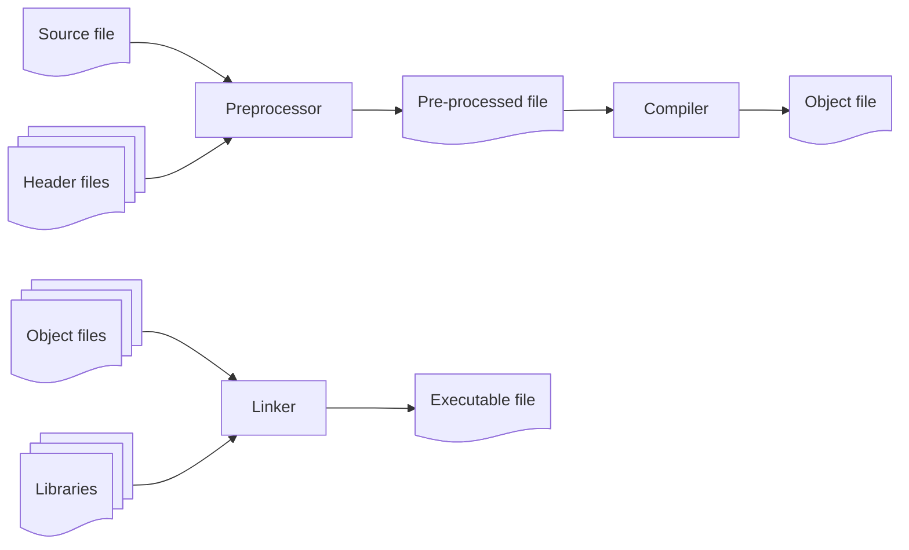
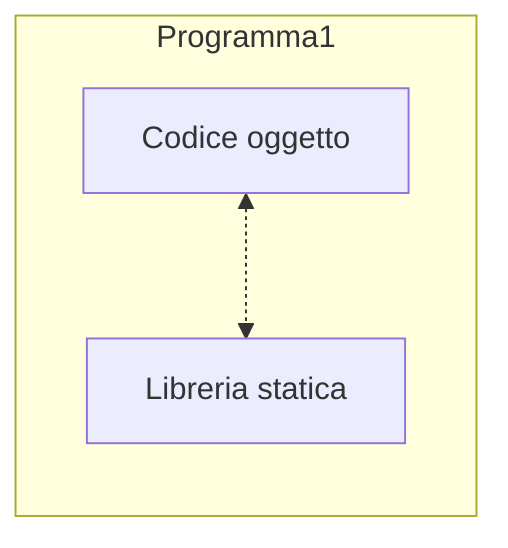
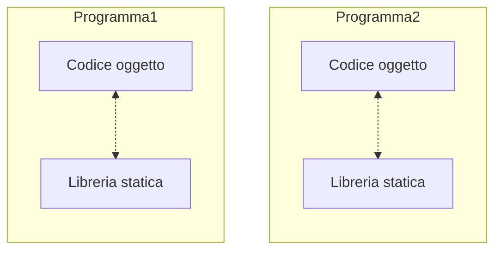
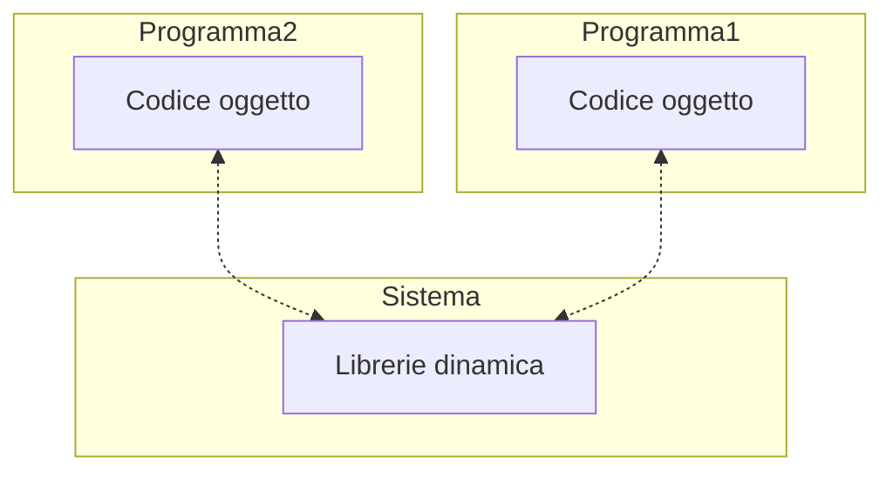
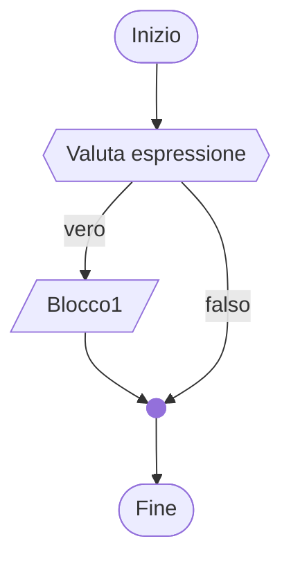
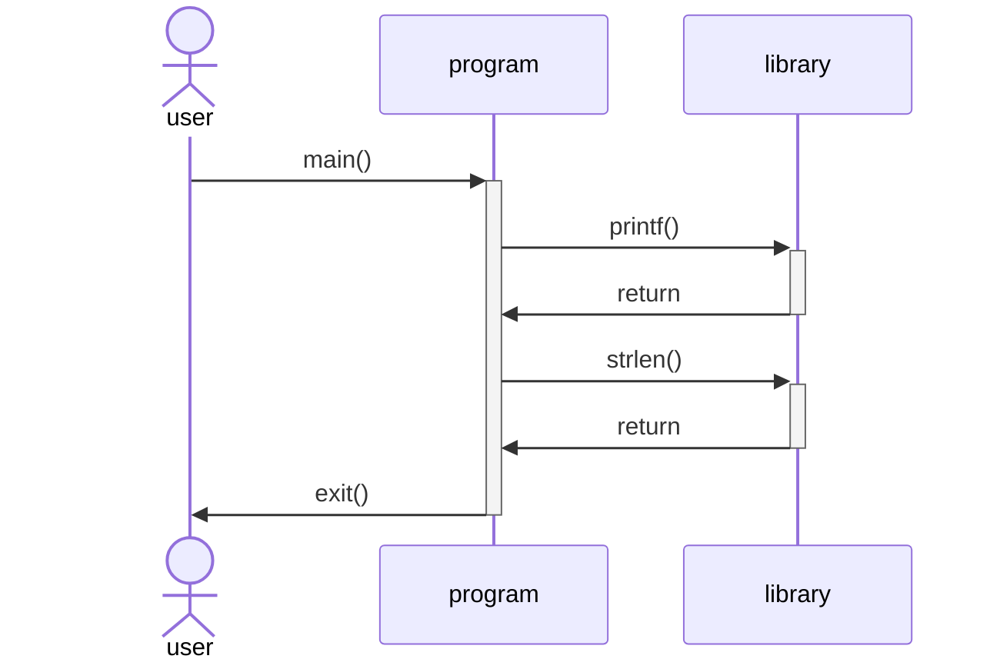

# 2 - Introduzione al “C”

Ing. Giancarlo Degani

---
level: 3
layout: image-right

image: /kernighan.png

---

# Il linguaggio C

- Sviluppato da Dennis Ritchie ai Bell Labs nel 1972 per realizzare il sistema operativo UNIX
- Linguaggio compilato
- Compilatore disponibile per tutte le piattaforme
- Codice molto efficiente

---
level: 3

---

# Il linguaggio C, caratteristiche

- Adatto sia come linguaggio ad alto livello che a basso livello (operazioni sui bit)
- Tantissime librerie disponibili
- Linguaggio procedurale, non ad oggetti (Aggiunti nel C++)
- Gestione della memoria “manuale” (Non c’è garbage collector)

---
level: 3

---

# Librerie

- In un linguaggio ad alto livello le funzioni di base sono fornite dal linguaggio ( lettura da tastiera, scrittura su schermo, lettura/scrittura da file)
- Queste operazioni elementari sono disponibili sotto forma di funzioni
- Le funzioni sono raccolte e distribuite sotto forma di librerie

---
level: 3

---

# Come si scrive un programma?

- Bastano un editor di testo per scrivere il file sorgente ed un compilatore o interprete per tradurre il sorgente in linguaggio macchina
- Solitamente si usa uno strumento definito Integrated Development Environment (IDE)
- CLion è un IDE specifico per C/C++

---
level: 3

---

# hello, world

<<< @/snippets/example01/main.c txt {all}{lines:true}

---
level: 3

---

# hello, world

<<< @/snippets/example01/main.c c {all|1-4|6-7|9-15|17-18|19|all}{lines:true}

--
level: 3

---

# Creazione di un eseguibile

Il processo di creazione di un eseguibile a partire dai sorgenti è composto da 2 fasi:

- **compilazione**: il sorgente viene compilato, ma alcune parti (le “funzioni di base”) sono ancora mancanti; viene generato un file intermedio detto file oggetto
- **linking**: il file oggetto e le librerie vengono unite (collegate – “link”) così da aggiungere al file oggetto le parti mancanti e costituire un unico file eseguibile. La fase di link può creare un eseguibile collegando insieme più file oggetto e più librerie.

---
level: 3

---

# Processo di build di un programma C



---
layout: two-cols
level: 3

---

# Build manuale

Preprocess

```txt
$ gcc -E hello.c -o hello.i

```

::right::

<<< @/snippets/example02/main.i#snippet c {all}{lines:true}

---
layout: two-cols
level: 3

---

# Build manuale

Translate

```txt
$ gcc -S hello.i -o hello.asm

```

::right::

<<< @/snippets/example02/main.asm c {all}{lines:true}

---
level: 3

---

# Librerie

- In un linguaggio ad alto livello le funzioni di base sono fornite dal linguaggio ( lettura da tastiera, scrittura su schermo, lettura/scrittura da file)
- Queste operazioni elementari sono disponibili sotto forma di funzioni
- Le funzioni sono raccolte e distribuite sotto forma di librerie

---
layout: two-cols

level: 3

---

# Librerie statiche

Nella creazione del programma eseguibile, il codice oggetto e le librerie vengono uniti (collegati) a formare un unico file binario.

::right::



---
layout: two-cols

level: 3

---

# Librerie statiche

Le librerie statiche vengono incluse in ogni programma che le usa:

- Spreco di memoria
- Manutenzione onerosa

::right::



---
layout: two-cols

level: 3

---

# Librerie dinamiche

- Nella creazione del programma eseguibile le librerie vengono referenziate, non incluse
- La libreria viene caricata in memoria al momento dell’esecuzione
- La libreria può essere condivisa da più programmi eseguibili
- Manutenzione semplificata

::right::



---
level: 3

---

## title

|           |    |   |   |   |   |   |   |
|---        |--- |---|---|---|---|---|---|
| **char**  | H  |e  | l | l | o |!  |\0 |
| **Dec**   | 72 |101|108|108|111| 33| 0 |
| **Hex**   | 48 | 65| 6C| 6C| 6F| 21| 0 |

---



---
layout: two-cols-small-header

level: 3

---

# Code

::left::

left

::right::

<<< @/snippets/example_01.c c {all|5|7|all}{lines:true}

---
layout: two-cols

level: 3

---

# latex

asd ad a
sadsd

::right::

<br>
<br>

---
layout: two-cols

level: 3

---

# Code

::left::

left

::right::

<<< @/snippets/example_01.c c {all|5|7|all}{lines:true}

---
level: 3

---

# Esempio for


