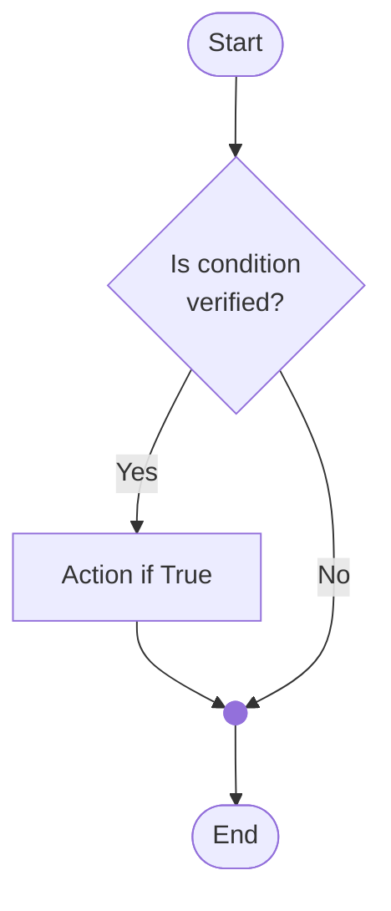
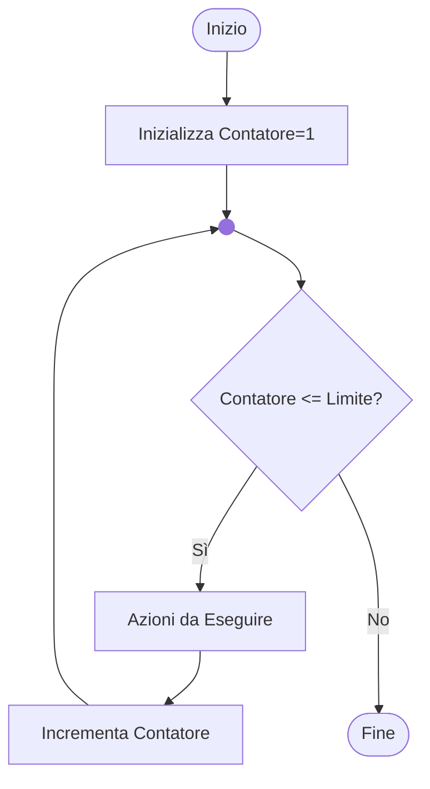
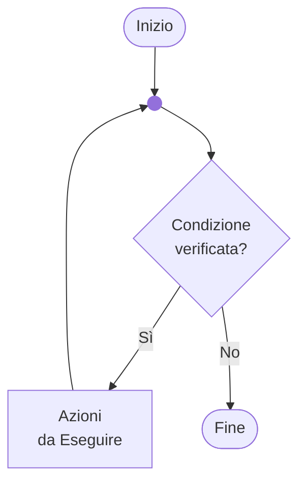
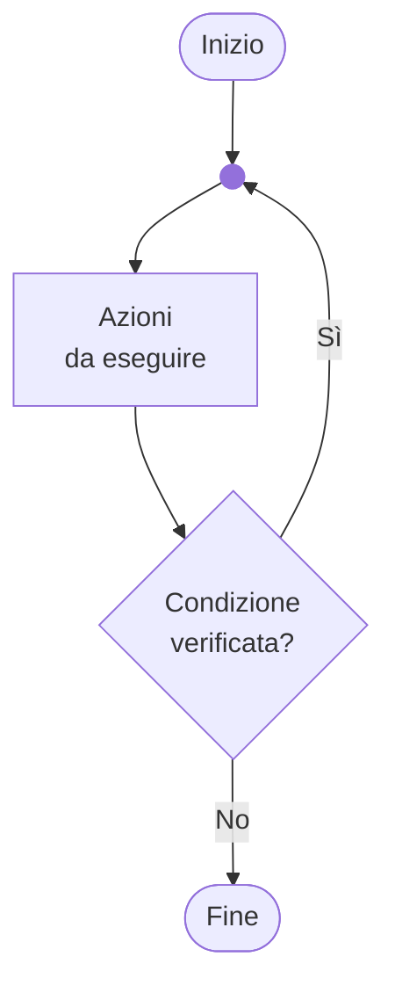

# 3 - Istruzioni condizionali e cicli

Ing. Giancarlo Degani

---
layout: two-cols

level: 3

---

# Esempio

- Scope di visibilità {}
- Stampa su schermo di numeri interi %d
- Overriding

::right::
<Transform :scale="1.2">
<<< @/snippets/example03/main.c c {all}{lines:true}
</Transform>

---
level: 3

---

# Operatori di confronto o relazionali

|Operator name|Syntax|
|:---|:---:|
|Equal to|a == b|
|Not equal to|a!=b|
|Greater than|a > b|
|Less than|a < b|
|Greater than or equal to|a >= b|
|Less than or equal to|a <= b|

---
level: 3

---

# Costanti intere decimali

- Sono sequenze di cifre decimali eventualmente precedute da ‘+’ o ‘–’
- Sono del tipo int se possibile, altrimenti long se possibile, altrimenti unsigned long
- Se non compatibili con un unsigned long si ha un errore
- Sono di tipo long se seguite dalla lettera L
- Sono unsigned se seguite dalla lettera U

123 -> int

123L -> long int

123U -> unsigned int

123UL -> unsigned long int

---
level: 3

---

# Costanti intere esadecimali

Una costante intera è considerata essere in base 16 se è preceduta da 0x oppure da 0X (zero X) e può contenere le cifre da 0 a 9 e da A a F (maiuscole e minuscole):

0xA == 10<sub>10</sub>

0x10 == 16<sub>10</sub>

---
level: 3

---

# Costanti numeriche

- Il modificatore const nella definizione delle variabili informa il compilatore che queste non dovranno essere modificate
- Il valore della variabile const deve essere specificato nell’inizializzazione, può anche essere un’espressione di cui viene calcolato il risultato

<br>

<Transform :scale="1.5">
```c
const double Pi = 3.141592653;
const double Pi = 4.0*atan(1.0);
```
</Transform>

---
level: 3

---

# Costanti simboliche

- E’ possibile dare un nome (un identificatore) ad una quantità costante, questo nome è detto simbolo (per convenzione in maiuscolo)
- Prima della compilazione, il pre-processore cerca i simboli definiti con direttive #define e sostituisce ogni occorrenza del simbolo nome con la corrispondente sequenza_di_caratteri
- Esempi:

<Transform :scale="1.5">

```c
#define nome sequenza_di_caratteri

#define TRUE 1
#define FALSE 0
#define DIM 80
#define BANNER “#################################\n”

```

</Transform>

---
level: 3

---

# Costanti simboliche

- La sostituzione dei simboli inizia a partire dalla riga dove è presente la #define e continua fino a fine file (ignorando la struttura a blocchi del programma)
- Non è un’istruzione C di assegnazione, ma una direttiva del pre-processore, quindi:
  - non bisogna mettere il carattere ‘=’ tra il nome del simbolo e la sequenza_di_caratteri
  - non si deve mettere il ‘;’ a fine riga
- La sequenza di caratteri può contenere spazi e termina a fine riga

---
level: 3

---

# Riferimenti

- https://man7.org/linux/man-pages/man3/printf.3.html
- https://en.cppreference.com/w/c/language

---
level: 3

---

# Operatori logici

|Operator name|Syntax|
|:---|:---:|
|Logical negation (NOT)|!a <br> **not** a|
|Logical AND|a && b <br> a **or** b|
|Logical OR|a \|\| b <br> a **or** b|

---
level: 3

---

# Valutazione delle espressioni logiche

- Vengono valutate da sx a dx
- Si possono usare le parentesi per alterare l’ordine di valutazione
- La valutazione termina appena è possibile stabilire il risultato complessivo

---
level: 3

---

# Altri operatori

|Operator name|Syntax|
|:---|:---:|
|Function call| f **(** a, b **)** |
|Comma|a **,** b|
|Sizeof| **sizeof**( a ) |
|Conversion (C-style cast)| **(** a valid C Type **)**|

---
layout: two-cols
level: 3

---

# Esecuzione condizionale - IF

- Viene valutata una condizione
- Se la condizione è vera, l’elaborazione prosegue con il ramo di sinistra
- Se la condizione è false,  l’elaborazione prosegue con il ramo di destra

::right::



---
level: 3

---

# Esecuzione condizionale

- Sintassi (minima): <br>

```txt
    if (condizione) <br>
       blocco istruzioni
```

- Il blocco di istruzioni deve essere racchiuso tra {} se contiene più istruzioni
- Se c’è una sola istruzione, non serve “;” al termine dell’istruzione
- Non serve il “;” dopo la parentesi “}”

---
layout: two-cols-header
level: 3

---

# Esempi

::left::

<Transform :scale="2">
```
if( condizione )
  istruzione;
```
</Transform>

::right::

<Transform :scale="2">
```
if( condizione ) {
  istruzione 1;
  istruzione 2;
}
```
</Transform>

---
layout: two-cols
level: 3

---

# Esempio

- Chiede un numero e, se è positivo, lo stampa
- Le parentesi {} sono richieste avendo un blocco di più istruzioni

::right::

<br>
<br>

<<< @/snippets/example04/main.c#blocco_if c {*}{lines:true}

---
layout: two-cols
level: 3

---

# Esecuzione condizionale - IF-ELSE

- Se la condizione è verificata esegue il blocco 1 altrimenti il blocco 2
- È richiesta quando si hanno più di due casi che necessitano di elaborazioni diverse

::right::


---
level: 3

---

# ESERCIZIO

Scrivere un programma per la gestione elementare di un carrello della spesa.
Il programma deve chiedere input:

- Il numero di oggetti contenuti nel carrello
- Il prezzo unitario

Il programma deve calcolare il costo totale del carrello:

- Se il numero di oggetti è maggiore di 10, applicare lo sconto del 10%
- Calcorare il costo al lordo dell’IVA del 22%
- Stampare a schermo (vedi esempio):

Il dettaglio del carrello, l’imponibile, l’IVA, ed il totale lordo

---
level: 3

---

# ESERCIZIO

Output richiesto:

<Transform :scale="2">

```txt
===== Dettaglio del Carrello =====
Numero di oggetti: 12
Prezzo unitario: 200.00
Totale prima dello sconto: 2400.00
Sconto applicato: 240.00
Imponibile (dopo sconto): 2160.00
IVA (22%): 475.20
Totale lordo: 2635.20
==============================
```

</Transform>

---
level: 3

---

# SELEZIONE MULTIPLA - SWITCH

<Transform :scale="2">

```c
switch ( espressione ){
  case valore1:
    blocco di istruzioni;

  case valore2:
    blocco di istruzioni;

  default:
    Blocco di 'default';
}
```

</Transform>

---
level: 3

---

# SELEZIONE MULTIPLA

- L’espressione deve restituire un valore intero ( char, short, int, long)
- I valori sono costanti note al momento della compilazione
- L’elaborazione inizia in corrispondenza del primo ‘case’ verificato.
- Si possono inserire più statement case con un solo blocco di istruzione;
- Usare **break** per uscire dalla selezione multipla terminato un blocco di
istruzioni !

---
level: 3

---

# ITERAZIONI

Problema: Visualizzare i numeri interi da 0 a 100

<Transform :scale="2">

```c
printf(“0\n”);
printf(“1\n”);
printf(“2\n”);
…
```

</Transform>

---
level: 3

---

# ITERAZIONI

- Si parla di iterazioni quando una istruzione, o un blocco di istruzioni, vengono
eseguite più volte
- Le strutture iterative sono comunemente dette cicli o loop
- Sono controllati da una condizione di permanenza nel ciclo

---
layout: two-cols
level: 3

---

# ITERAZIONI: IL CICLO FOR

Il ciclo **for** ripete l'esecuzione del blocco di
istruzioni fintanto che la condizione è
verificata

```c
int j ;
for ( j = 0; j < 100; j++){
  blocco di istruzioni
}
```

::right::



---
level: 3

---

# ITERAZIONI: IL CICLO FOR

<Transform :scale="1.7">

for ( **Inizializzazione**; **controllo**; **incremento**){

   Blocco di istruzioni

}

</Transform>

---
layout: two-cols

level: 3

---

# ITERAZIONI: IL CICLO WHILE

- Fa eseguire un blocco di codice
fino a che una certa condizione
è verificata
- Valuta la condizione prima di
eseguire il blocco
- Se la condizione è inizialmente
falsa, il blocco non viene
eseguito neppure una volta
- La condizione deve essere
sempre presente

::right::



---
level: 3

---

# ITERAZIONI: IL CICLO WHILE

<Transform :scale="1.7">

while ( **condizione** ) \{

Blocco di istruzioni

\}
</Transform>

---
layout: two-cols

level: 3

---

# ESEMPIO: IL CICLO WHILE

- Stampa i numeri da 0 a 1000
- Terminato il ciclo, il valore di i è 1001

::right::

<br>
<br>
<Transform :scale="2">

<<< @/snippets/example03/ciclo_while.c#ciclo c {*}{lines:true}

</Transform>

---
layout: two-cols

level: 3

---

# ESEMPIO: il ciclo WHILE

Somma dei valori introdotti finché non viene immesso il valore 0

::right::

<br>
<br>
<Transform :scale="2">

<<< @/snippets/example03/ciclo_while2.c#ciclo c {*}{lines:true}

</Transform>

---
layout: two-cols

level: 3

---

# EQUIVALENZA DI FOR E WHILE

For e While consentono di esprimere lo stesso comportamento.

I due esempi a fianco sono equivalenti.

::right::

<br>
<br>
<Transform :scale="2">

<<< @/snippets/example03/ciclo_for_while.c#ciclo c {*}{lines:true}

</Transform>

---
layout: two-cols

level: 3

---

# ITERAZIONI: IL CICLO DO-WHILE

- Esegue un blocco di codice
fino a che una certa condizione
è verificata
- Valuta la condizione dopo aver
eseguito il blocco di istruzioni
- Il blocco viene eseguito almeno
una volta
- La condizione deve essere
sempre presente

::right::



---
level: 3

---

# ITERAZIONI: IL CICLO DO-WHILE

<Transform :scale="2">

do \{

Blocco di istruzioni

\} while ( **condizione** ) ;
</Transform>

---
layout: two-cols
level: 3

---

# ITERAZIONI: IL CICLO DO-WHILE

Stampa i numeri da 0 a 1000

::right::

<br>
<br>
<Transform :scale="2">

<<< @/snippets/example03/ciclo_do_while.c#ciclo c {*}{lines:true}

</Transform>

---
level: 3

---

# CODIFICA DI NUMERI REALI

Se convertiamo il numero in notazione esponenziale, le informazioni da
memorizzare sono:

- Segno
- Mantissa
- Esponente

Esempio:
<Transform :scale="1.5">
-12.34 == -0.1234 * 10<sup>2</sup> == [ segno ] 0. [mantissa] * 10<sup>[esponente]</sup>
</Transform>

---
level: 3

---

# CODIFICA FLOATING-POINT DEI NUMERI REALI

Un numero in virgola mobile, secondo lo standard IEEE è rappresentato su
parole di 32, 64 o 128 bit divisi in tre parti: segno, mantissa ed esponente

<Transform :scale="1.5">
```
1     8            23                lunghezza in bit
+-+--------+-----------------------+
|S|   Esp. |     Mantissa          |
+-+--------+-----------------------+
31 30    22                       0  indice dei bit
```

</Transform>
<br>
<br>

Il valore del numero rappresentato è calcolabile come:

<br>

$$
(-1 )^s*2^E*M
$$

---
level: 3

---

# ESEMPIO

Conversione in precisione semplice (32bit):

<Transform :scale="1.5">
```
-5,82812510 = 1 | 1000 0001 | 0111 0101 0000 0000 0000 000
```
</Transform>

Se la mantissa eccede i 23 bit, viene troncata, per questo si parla di
precisione finita.

Per comodità di lettura il numero viene solitamente rappresentato in
esadecimale:
<Transform :scale="1.5">

```txt
1100 0000 1011 1010 1000 0000 0000 0000 = C0 BA 80 00
```

</Transform>

---
level: 3

---

# TIPI DI DATI PRIMITIVI PER NUMERI IN VIRGOLA MOBILE

|Type|Description|Format|
|---|---|---|
|**float**|Real floating-point type, usually referred to as a single-precision floating-point type|%f<br>%e|
|**double**|Real floating-point type, usually referred to as a double-precision floating-point type|%lf<br>%le|
|**long&nbsp;double**|Real floating-point type, usually mapped to an extended precision floating-point number format|%Lf<br>%Le|

---
level: 3

---

# ESERCIZIO

Scrivere un programma che calcoli la radice quadrata x di un numero n:

- Usare l’algoritmo di bisezione per risolvere l’equazione x<sup>2</sup>=n
  - Non usare la funzione di libreria sqrt
  - Calcolare la soluzione con una precisione pari a 0.000 001
- Il numero in input deve essere maggiore di 1
  - In caso contrario stampare un messaggio di errore e terminare il programma
- Prima di scrivere il codice, progettare l’algoritmo con un flowchart

Consegnare: il flowchart, il codice, lo screenshot dell'output

---
layout: two-cols
level: 3

---

# ITERAZIONI: IL CICLO FOR ANNIDATO

::right::

<br>
<br>
<Transform :scale="1.4">

<<< @/snippets/example03/ciclo_nested.c#ciclo c {*}{lines:true}

</Transform>

---
level: 3

---

# formula di newton

$$
 \left\{ \begin{array}{cl}\displaystyle \text{}
x_{i+1} & = \frac{1}{2} (x_{i}+\frac{A}{x_{i}})\\
x_{i=0} & =A
\end{array}
\right.

$$
---
level: 3

---

<br>
$$
M_n = \frac{(n-1)*M_{n-1}+a_n}{n}

$$
