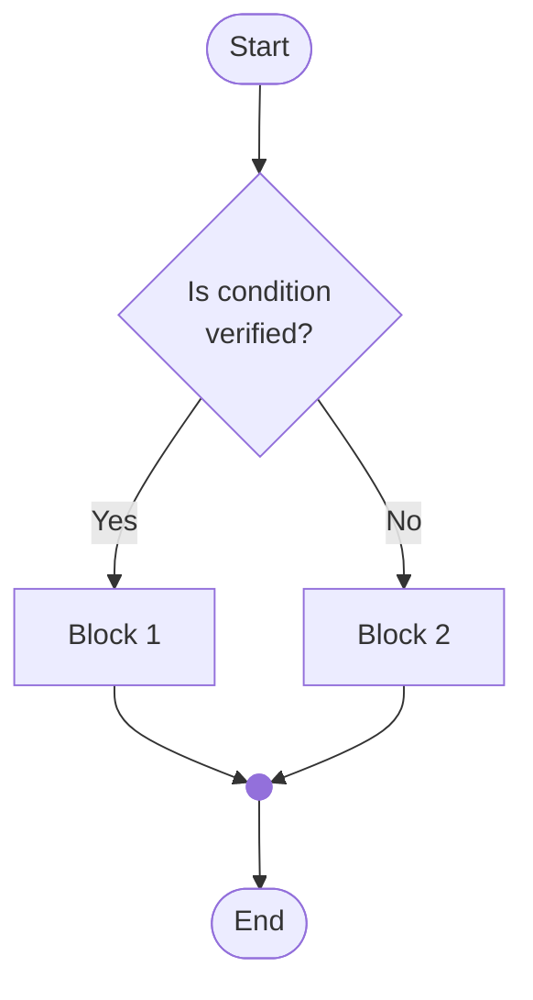
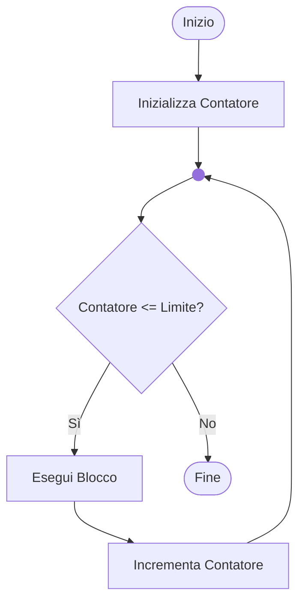
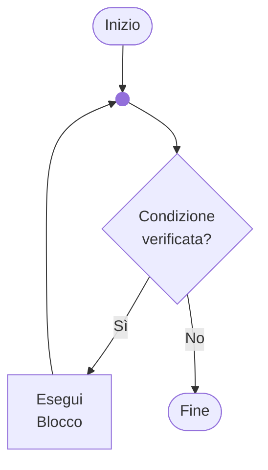
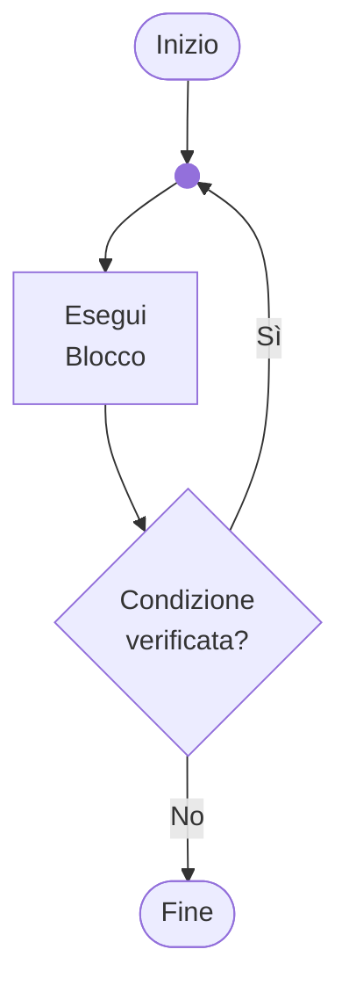

# 3 - Istruzioni condizionali e cicli

Ing. Giancarlo Degani

---

# Controllo del flusso di esecuzione

Finora abbiamo visto programmi che eseguono le istruzioni in **sequenza** (una dopo l'altra).

Il controllo del flusso ci permette di:

## Esecuzione condizionale

Eseguire blocchi di codice **solo se** certe condizioni sono vere

- `if`, `if-else`, `switch`

## Esecuzione ripetuta (iterazione)

Ripetere blocchi di codice **più volte**

- `for`, `while`, `do-while`

Queste strutture sono fondamentali per scrivere programmi che prendono decisioni e automatizzano operazioni ripetitive.

---

# Recap: Condizioni in C

**Valori booleani in C:**

- `0` = falso
- qualsiasi valore ≠ 0 = vero

**Operatori già visti (slides precedenti):**

- Relazionali: `==`, `!=`, `<`, `>`, `<=`, `>=`
- Logici: `&&` (AND), `||` (OR), `!` (NOT)

```c
int age = 25, score = 85;

if (age >= 18 && score > 80) {  // Entrambe le condizioni devono essere vere
    printf("Ammesso al corso avanzato\n");
}
```

---
layout: two-cols

---

# Esecuzione condizionale - IF

- Viene valutata una condizione
- Se la condizione è vera, l'elaborazione prosegue con il blocco di istruzioni
- Se la condizione è falsa, il blocco viene saltato

::right::

```mermaid {scale: 0.9, alt: 'Flowchart showing if statement control flow'}
flowchart TD
    Start([Start]) --> Condition{Is condition <br/> verified?}
    Condition -- Yes --> Action1[Action if True]
    Action1 -->   J@{ shape: f-circ, label: "Junction" }
    Condition -- No --> J
    J --> End([End])
```

---

# Sintassi dell'istruzione IF

## Forma base

```c
if (condizione) {
    // blocco di istruzioni eseguito se condizione è vera
}
```

## Regole

- La **condizione** deve essere tra parentesi tonde `( )`
- Il **blocco** deve essere tra parentesi graffe `{ }` se contiene più istruzioni
- Se c'è una sola istruzione, le graffe sono opzionali (ma **raccomandate per chiarezza**)
- **Non** mettere `;` dopo la condizione!

---
layout: two-cols

---

# Esempi di IF

## IF con una sola istruzione

```c
if (condizione)
    istruzione;
```

## IF con blocco di istruzioni

```c
if (condizione) {
    istruzione_1;
    istruzione_2;
    istruzione_3;
}
```

::right::

## ⚠️ Errore comune

```c
// ❌ ERRORE: ; dopo condizione
if (x > 0);  {
    printf("Positivo\n");
}
// Il blocco viene SEMPRE eseguito!
```

## ✅ Corretto

```c
if (x > 0) {
    printf("Positivo\n");
}
```

---

# Esempio pratico: IF

Chiede un numero e, se è positivo, lo stampa.

Le parentesi `{}` sono richieste avendo un blocco di più istruzioni.

<<< @/snippets/example04/main.c#blocco_if c {*}{lines:true}

---
layout: two-cols

---

# Esecuzione condizionale - IF-ELSE

- Se la condizione è verificata esegue il blocco 1
- Altrimenti esegue il blocco 2
- Permette di gestire esattamente due casi alternativi

::right::



---

# Sintassi dell'istruzione IF-ELSE

```c
if (condizione) {
    // blocco 1: eseguito se condizione è vera
} else {
    // blocco 2: eseguito se condizione è falsa
}
```

## Esempio

```c
int age = 17;

if (age >= 18) {
    printf("Sei maggiorenne\n");
} else {
    printf("Sei minorenne\n");
}
// Output: Sei minorenne
```

---

# IF-ELSE annidati (nested)

È possibile annidare più istruzioni if-else per gestire più di due casi:

```c
int voto = 75;

if (voto >= 90) {
    printf("Eccellente\n");
} else if (voto >= 75) {
    printf("Buono\n");
} else if (voto >= 60) {
    printf("Sufficiente\n");
} else {
    printf("Insufficiente\n");
}
// Output: Buono
```

## Nota

- `else if` è in realtà un `else` seguito da un altro `if`
- La valutazione avviene dall'alto verso il basso
- Si ferma alla prima condizione vera

---

# Quando usare IF vs IF-ELSE vs IF annidati

| Situazione | Struttura da usare | Esempio |
|------------|-------------------|---------|
| Una sola condizione da verificare | `if` | "Stampa un avviso se la temperatura è alta" |
| Due alternative mutualmente esclusive | `if-else` | "Maggiorenne o minorenne" |
| Più di due alternative ordinate | `if-else if-else` | "Voto: eccellente, buono, sufficiente, insufficiente" |
| Molte alternative su stesso valore | `switch` | "Menu con 5+ opzioni numerate" |

---

# ESERCIZIO: Carrello della spesa

Scrivere un programma per la gestione elementare di un carrello della spesa.

## Input richiesto

- Il numero di oggetti contenuti nel carrello
- Il prezzo unitario

## Calcoli da eseguire

- Se il numero di oggetti è maggiore di 10, applicare lo sconto del 10%
- Calcolare il costo al lordo dell'IVA del 22%

## Output

Stampare il dettaglio del carrello, l'imponibile, l'IVA, ed il totale lordo

---

# ESERCIZIO: Output richiesto

```txt
===== Dettaglio del Carrello =====
Numero di oggetti: 12
Prezzo unitario: 200.00
Totale prima dello sconto: 2400.00
Sconto applicato: 240.00
Imponibile (dopo sconto): 2160.00
IVA (22%): 475.20
Totale lordo: 2635.20
===================================
```

**Suggerimento:** Usa `if` per verificare se applicare lo sconto, poi calcola IVA e totale.

---

# Selezione multipla - SWITCH

Quando si devono gestire molti casi basati su un **singolo valore intero**, `switch` è più leggibile di tanti `if-else if`:

```c
switch (espressione) {
    case valore1:
        blocco di istruzioni;
        break;
    
    case valore2:
        blocco di istruzioni;
        break;
    
    default:
        blocco di default;
}
```

---

# Regole dello SWITCH

## Caratteristiche

- L'**espressione** deve restituire un valore **intero** (char, short, int, long)
- I **valori** dei case devono essere **costanti** note a tempo di compilazione
- L'elaborazione inizia dal primo `case` che corrisponde al valore
- **break** è necessario per uscire dallo switch (altrimenti continua nei case successivi!)
- **default** è opzionale ed esegue se nessun case corrisponde

## ⚠️ Non dimenticare break

```c
int x = 2;
switch (x) {
    case 1: printf("Uno\n");    // Manca break!
    case 2: printf("Due\n");    // Eseguito
    case 3: printf("Tre\n");    // Eseguito anche questo!
}
// Output: Due, Tre (fall-through)
```

---

# Esempio pratico: SWITCH

```c
int choice;
printf("Scegli un'opzione (1-3): ");
scanf("%d", &choice);

switch (choice) {
    case 1:
        printf("Hai scelto l'opzione 1\n");
        break;
    
    case 2:
        printf("Hai scelto l'opzione 2\n");
        break;
    
    case 3:
        printf("Hai scelto l'opzione 3\n");
        break;
    
    default:
        printf("Opzione non valida\n");
}
```

---

# SWITCH: case multipli per stesso blocco

È possibile avere più `case` che eseguono lo stesso blocco:

```c
char grade;
printf("Inserisci il voto (A-F): ");
scanf(" %c", &grade);

switch (grade) {
    case 'A':
    case 'a':
        printf("Eccellente!\n");
        break;
    
    case 'B':
    case 'b':
        printf("Buono\n");
        break;
    
    case 'C':
    case 'c':
        printf("Sufficiente\n");
        break;
    
    default:
        printf("Voto non valido\n");
}
```

---

layout: two-cols
---

# Esercizio: Menu con SWITCH

**Obiettivo:** Creare un menu interattivo usando `switch` e `do-while`

**Requisiti:**

1. Crea un programma calcolatrice con menu
2. Mostra opzioni: 1=Somma, 2=Sottrazione, 3=Moltiplicazione, 4=Divisione, 5=Esci
3. Leggi due numeri dall'utente
4. Usa `switch` per eseguire l'operazione scelta
5. Usa `do-while` per ripetere fino a scelta "Esci"

::right::

**Esempio di esecuzione:**

```text
=== CALCOLATRICE ===
1. Somma
2. Sottrazione
3. Moltiplicazione
4. Divisione
5. Esci
Scelta: 1
Primo numero: 10
Secondo numero: 5
Risultato: 15.00
```

---

# Quando usare IF vs SWITCH

| Criterio | IF-ELSE IF | SWITCH |
|----------|------------|--------|
| **Tipo di condizione** | Qualsiasi espressione booleana | Solo valori interi/char |
| **Complessità condizioni** | Condizioni complesse (range, combinazioni) | Valori esatti e costanti |
| **Leggibilità** | Meglio per 2-4 alternative | Meglio per 5+ alternative |
| **Performance** | Valutazione sequenziale | Può essere ottimizzato dal compilatore |

## Esempi

```c
// ✅ Usa IF per range
if (age < 18) {...}
else if (age < 65) {...}

// ✅ Usa SWITCH per valori esatti
switch (day_of_week) {
    case 1: ... // Lunedì
    case 2: ... // Martedì
    ...
}
```

---

# ITERAZIONI

## Problema

Visualizzare i numeri interi da 0 a 100

## Soluzione ingenua

```c
printf("0\n");
printf("1\n");
printf("2\n");
printf("3\n");
// ... 97 righe omesse ...
printf("100\n");
```

## ❌ Problemi

- Codice ripetitivo e difficile da mantenere
- Impossibile se il numero di iterazioni è variabile
- Errori di battitura

---

# ITERAZIONI: introduzione

- Si parla di **iterazioni** quando una istruzione, o un blocco di istruzioni, vengono eseguite **più volte**
- Le strutture iterative sono comunemente dette **cicli** o **loop**
- Sono controllati da una **condizione di permanenza** nel ciclo
- C fornisce tre tipi di cicli:
  - **for**: quando si conosce il numero di iterazioni
  - **while**: quando la condizione è valutata prima dell'esecuzione
  - **do-while**: quando la condizione è valutata dopo l'esecuzione

---
layout: two-cols

---

# ITERAZIONI: IL CICLO FOR

Il ciclo **for** ripete l'esecuzione del blocco di istruzioni fintanto che la condizione è verificata.

## Sintassi

```c
for (inizializzazione; condizione; incremento) {
    blocco di istruzioni
}
```

## Esempio

```c
int i;
for (i = 0; i < 100; i++) {
    printf("%d\n", i);
}
```

::right::



---

# Anatomia del ciclo FOR

```c
for (inizializzazione; condizione; incremento) {
    blocco di istruzioni
}
```

| Parte | Quando viene eseguita | Scopo |
|-------|----------------------|-------|
| **inizializzazione** | Una sola volta all'inizio | Imposta il valore iniziale del contatore |
| **condizione** | Prima di ogni iterazione | Decide se continuare il ciclo (1=sì, 0=no) |
| **incremento** | Dopo ogni iterazione | Modifica il contatore |
| **blocco** | Ad ogni iterazione (se condizione vera) | Operazioni da ripetere |

## Esempio annotato

```c
//     ↓ inizio      ↓ fino a quando?  ↓ come procede?
for (int i = 0;     i < 10;            i++) {
    printf("%d\n", i);  // ← Eseguito 10 volte (i = 0,1,2,...,9)
}
```

---

# Varianti del ciclo FOR

## Dichiarazione della variabile nel for (C99+)

```c
for (int i = 0; i < 10; i++) {  // i esiste solo nel ciclo
    printf("%d\n", i);
}
// printf("%d", i);  // ❌ ERRORE: i non esiste qui
```

## Incremento diverso

```c
// Conta per 2
for (int i = 0; i < 10; i += 2) {
    printf("%d ", i);  // Output: 0 2 4 6 8
}

// Conta all'indietro
for (int i = 10; i > 0; i--) {
    printf("%d ", i);  // Output: 10 9 8 7 6 5 4 3 2 1
}
```

---

layout: two-cols
---

# Esercizio: Somma numeri pari

**Obiettivo:** Usare un ciclo `for` con condizioni

**Requisiti:**

1. Chiedi all'utente un numero N
2. Calcola la somma di tutti i numeri **pari** da 0 a N (incluso)
3. Stampa il risultato

**Esempio:**

```text
Inserisci N: 10
Somma dei numeri pari da 0 a 10: 30
(Spiegazione: 0+2+4+6+8+10 = 30)
```

::right::

**Suggerimenti:**

- Usa `for (int i = 0; i <= n; i++)`
- Usa `if (i % 2 == 0)` per verificare se un numero è pari
- Inizializza `sum = 0` prima del ciclo

---

# Esempi pratici di FOR

## Calcolare la somma dei primi N numeri

```c
int n = 100;
int sum = 0;

for (int i = 1; i <= n; i++) {
    sum += i;
}
printf("Somma da 1 a %d = %d\n", n, sum);  // 5050
```

## Stampare la tabellina del 7

```c
for (int i = 1; i <= 10; i++) {
    printf("7 x %d = %d\n", i, 7 * i);
}
```

---
layout: two-cols

---

# ITERAZIONI: IL CICLO WHILE

- Esegue un blocco di codice **finché** una certa condizione è verificata
- Valuta la condizione **prima** di eseguire il blocco
- Se la condizione è inizialmente falsa, il blocco **non viene eseguito neppure una volta**

## Sintassi

```c
while (condizione) {
    blocco di istruzioni
}
```

::right::



---
layout: two-cols

---

# ESEMPIO: IL CICLO WHILE

Stampa i numeri da 0 a 1000.

Terminato il ciclo, il valore di `i` è 1001.

::right::

<Transform :scale="2">

<<< @/snippets/example03/ciclo_while.c#ciclo c {*}{lines:true}

</Transform>

---
layout: two-cols

---

# ESEMPIO: ciclo WHILE con input

Somma dei valori introdotti finché non viene immesso il valore 0.

::right::

<Transform :scale="2">

<<< @/snippets/example03/ciclo_while2.c#ciclo c {*}{lines:true}

</Transform>

---
layout: two-cols

---

# EQUIVALENZA DI FOR E WHILE

`for` e `while` consentono di esprimere lo stesso comportamento.

I due esempi a fianco sono equivalenti.

::right::

<Transform :scale="2">

<<< @/snippets/example03/ciclo_for_while.c#ciclo c {*}{lines:true}

</Transform>

---

# Quando usare FOR vs WHILE

| Situazione | Ciclo consigliato | Esempio |
|------------|------------------|---------|
| **Numero di iterazioni noto** | `for` | "Stampa i numeri da 1 a 100" |
| **Iterazione su range/sequenza** | `for` | "Scorrere un array" |
| **Contatore esplicito necessario** | `for` | "Calcola fattoriale di n" |
| **Numero di iterazioni sconosciuto** | `while` | "Leggi input fino a 0" |
| **Condizione complessa** | `while` | "Continua finché errore < 0.001" |
| **Almeno una iterazione necessaria** | `do-while` | "Menu: chiedi scelta fino a 'exit'" |

## Regola generale

- **FOR**: "per ogni elemento da A a B"
- **WHILE**: "finché vale questa condizione"
- **DO-WHILE**: "fai almeno una volta, poi finché vale condizione"

---
layout: two-cols

---

# ITERAZIONI: IL CICLO DO-WHILE

- Esegue un blocco di codice finché una certa condizione è verificata
- Valuta la condizione **dopo** aver eseguito il blocco
- Il blocco viene eseguito **almeno una volta**

## Sintassi

```c
do {
    blocco di istruzioni
} while (condizione);
```

**Nota:** Il `;` dopo `while` è obbligatorio!

::right::



---
layout: two-cols

---

# ESEMPIO: ciclo DO-WHILE

Stampa i numeri da 0 a 1000.

Anche questo esempio è equivalente ai precedenti, ma garantisce almeno una esecuzione.

::right::

<Transform :scale="2">

<<< @/snippets/example03/ciclo_do_while.c#ciclo c {*}{lines:true}

</Transform>

---

# Esempio pratico: Validazione password

```c
#include <stdio.h>
#include <string.h>

int main(void) {
    char password[20];
    int attempts = 0;
    const int MAX_ATTEMPTS = 3;
    
    do {
        printf("Inserisci password: ");
        scanf("%s", password);
        attempts++;
        
        if (strcmp(password, "secret123") == 0) {
            printf("✅ Accesso consentito!\n");
            break;
        } else {
            printf("❌ Password errata. Tentativi rimasti: %d\n", 
                   MAX_ATTEMPTS - attempts);
        }
    } while (attempts < MAX_ATTEMPTS);
```

---

# Esempio pratico: Validazione password

```c
    if (attempts == MAX_ATTEMPTS) {
        printf("🔒 Account bloccato!\n");
    }
    
    return 0;
}
```

---

# DO-WHILE: caso d'uso tipico - Menu

Il caso d'uso più comune per `do-while` è un menu che deve essere mostrato almeno una volta:

```c
int choice;
do {
    printf("\n===== MENU =====\n");
    printf("1. Opzione 1\n");
    printf("2. Opzione 2\n");
    printf("3. Esci\n");
    printf("Scelta: ");
    scanf("%d", &choice);
    
    switch (choice) {
        case 1: printf("Eseguo opzione 1\n"); break;
        case 2: printf("Eseguo opzione 2\n"); break;
        case 3: printf("Arrivederci!\n"); break;
        default: printf("Scelta non valida\n");
    }
} while (choice != 3);
```

---

# Confronto tra i tre tipi di ciclo

| Caratteristica | FOR | WHILE | DO-WHILE |
|---------------|-----|-------|----------|
| **Controllo condizione** | Prima dell'esecuzione | Prima dell'esecuzione | Dopo l'esecuzione |
| **Minimo iterazioni** | 0 | 0 | 1 |
| **Uso tipico** | Iterazioni contate | Condizione complessa | Menu, validazione input |
| **Sintassi** | Compatta (tutto in una riga) | Più esplicita | Simile a while |

---

# Esempio equivalente

```c
// FOR
for (int i = 0; i < 3; i++) printf("%d ", i);

// WHILE
int i = 0;
while (i < 3) { printf("%d ", i); i++; }

// DO-WHILE
int i = 0;
do { printf("%d ", i); i++; } while (i < 3);

// Tutti stampano: 0 1 2
```

---

# Esempio pratico: Validazione input numerico

```c
#include <stdio.h>

int main(void) {
    int age;
    int valid = 0;
    
    // Continua a chiedere finché l'input non è valido
    while (!valid) {
        printf("Inserisci la tua età (0-120): ");
        
        if (scanf("%d", &age) != 1) {
            // Input non numerico
            printf("❌ Errore: inserisci un numero!\n");
            while (getchar() != '\n');  // Pulisci buffer
            continue;
        }
        
        if (age < 0 || age > 120) {
            printf("❌ Età non valida! Deve essere tra 0 e 120.\n");
            continue;
        }
        
        // Input valido!
        valid = 1;
        printf("✅ Età registrata: %d anni\n", age);
    }
    
    return 0;
}
```

**Mostra come usare `while`, `continue` e validazione input.**

---

# Controllo del flusso nei cicli: BREAK e CONTINUE

## BREAK

Esce **immediatamente** dal ciclo (for, while, do-while, switch):

```c
for (int i = 0; i < 10; i++) {
    if (i == 5) break;  // Esce quando i vale 5
    printf("%d ", i);
}
// Output: 0 1 2 3 4
```

## CONTINUE

Salta **l'iterazione corrente** e passa alla successiva:

```c
for (int i = 0; i < 10; i++) {
    if (i % 2 == 0) continue;  // Salta i numeri pari
    printf("%d ", i);
}
// Output: 1 3 5 7 9
```

---

# Esempi pratici: BREAK e CONTINUE

## Cerca un valore in un array

```c
int numbers[] = {3, 7, 12, 5, 9};
int search = 12;
int found = 0;

for (int i = 0; i < 5; i++) {
    if (numbers[i] == search) {
        found = 1;
        break;  // Trovato! Esci dal ciclo
    }
}
printf(found ? "Trovato!\n" : "Non trovato\n");
```

## Stampa solo i numeri divisibili per 3

```c
for (int i = 1; i <= 20; i++) {
    if (i % 3 != 0) continue;  // Salta se non divisibile per 3
    printf("%d ", i);  // Output: 3 6 9 12 15 18
}
```

---
layout: two-cols

---

# CICLI ANNIDATI (nested loops)

È possibile inserire un ciclo dentro un altro ciclo:

## Esempio: tabella di moltiplicazione

::right::

<Transform :scale="1.4">

<<< @/snippets/example03/ciclo_nested.c#ciclo c {*}{lines:true}

</Transform>

---

# CICLI ANNIDATI: esempi pratici

## Stampa un rettangolo di asterischi (5x3)

```c
for (int row = 0; row < 3; row++) {
    for (int col = 0; col < 5; col++) {
        printf("* ");
    }
    printf("\n");
}
// Output:
// * * * * *
// * * * * *
// * * * * *
```

---

# Esercizio: Tabellina interattiva

<div class="exercise-box">

**Obiettivo:** Usare cicli annidati per creare una tabella

**Requisiti:**

Crea un programma che stampa la tavola pitagorica (tabellina) da 1 a 10.

**Output atteso:**

```text
    1   2   3   4   5   6   7   8   9  10
  ------------------------------------
1 |  1   2   3   4   5   6   7   8   9  10
2 |  2   4   6   8  10  12  14  16  18  20
3 |  3   6   9  12  15  18  21  24  27  30
...
10| 10  20  30  40  50  60  70  80  90 100
```

**Suggerimento:** Usa due cicli `for` annidati (uno per righe, uno per colonne)

</div>

---

# CICLI ANNIDATI: esempi pratici

## Stampa un triangolo

```c
for (int row = 1; row <= 5; row++) {
    for (int col = 1; col <= row; col++) {
        printf("* ");
    }
    printf("\n");
}
// Output:
// *
// * *
// * * *
// * * * *
// * * * * *
```

---

# Esempio pratico: Elaborazione matrice dati

```c
#include <stdio.h>

int main(void) {
    // Matrice 3x4 con temperature giornaliere (3 settimane, 4 giorni)
    int temps[3][4] = {
        {22, 24, 23, 25},  // Settimana 1
        {20, 21, 19, 22},  // Settimana 2
        {25, 26, 24, 23}   // Settimana 3
    };
    
    printf("Analisi temperature:\n\n");
    
    for (int week = 0; week < 3; week++) {
        int sum = 0;
        printf("Settimana %d: ", week + 1);
        
        for (int day = 0; day < 4; day++) {
            printf("%d°C ", temps[week][day]);
            sum += temps[week][day];
        }
        
        float avg = sum / 4.0;
        printf("(Media: %.1f°C)\n", avg);
    }
    
    return 0;
}
```

**Output:** Mostra temperature e medie settimanali - caso d'uso reale!

---

# Scope delle variabili nei cicli

## Variabile dichiarata nel for (C99+)

```c
for (int i = 0; i < 10; i++) {
    printf("%d ", i);  // ✅ i esiste qui
}
// printf("%d", i);  // ❌ ERRORE: i non esiste fuori dal for
```

## Variabile dichiarata prima del ciclo

```c
int i;
for (i = 0; i < 10; i++) {
    printf("%d ", i);
}
printf("Finale: %d\n", i);  // ✅ i vale 10 (ultimo incremento)
```

## Buona pratica

- Dichiara le variabili nel for se non servono dopo
- Usa nomi descrittivi per cicli annidati (`row`, `col` invece di `i`, `j`)

---

# Esercizio: Ricerca numero in array

<div class="exercise-box">

**Obiettivo:** Usare `break` per interrompere la ricerca

**Requisiti:**

1. Crea un array di 10 numeri interi
2. Chiedi all'utente un numero da cercare
3. Usa un ciclo `for` per cercare il numero
4. Quando trovi il numero, stampa la posizione e usa `break`
5. Se il ciclo termina senza trovarlo, stampa "Non trovato"

**Esempio:**

```c
Array: {5, 12, 3, 9, 7, 15, 1, 8, 11, 4}
Cerca: 7
Output: Trovato in posizione 4
```

**Suggerimento:** Usa una variabile `found` per tracciare se hai trovato il numero.

</div>

---

# Errori comuni nei cicli

I cicli sono potenti ma anche una fonte frequente di bug. Ecco i problemi più comuni:

## 1. Errori off-by-one (OBOE - Off-By-One Error)

- Il ciclo esegue una iterazione in più o in meno del previsto
- Causato da condizioni `<` vs `<=` o inizializzazione errata

## 2. Cicli infiniti (Infinite loops)

- Il ciclo non termina mai perché la condizione rimane sempre vera
- Causato da dimenticanza dell'incremento o condizione mal formulata

## 3. Uso di variabili non inizializzate

- Comportamento imprevedibile se le variabili accumulo non sono inizializzate

## 4. Modifica dell'indice nel corpo del ciclo

- Alterare la variabile di controllo dentro il ciclo può causare comportamento inatteso

---
layout: two-cols

---

# Errore off-by-one: esempi

## ❌ Errore: stampa 0-9 invece di 1-10

```c
// Volevo stampare da 1 a 10
for (int i = 0; i < 10; i++) {
    printf("%d\n", i);
}
// Output: 0 1 2 3 4 5 6 7 8 9
```

## ❌ Errore: accesso fuori array

```c
int array[10];
// ERRORE: i va da 0 a 10 (11 valori)
// ma array ha solo indici 0-9!
for (int i = 0; i <= 10; i++) {
    array[i] = i * 2;  // ❌ Crash!
}
```

::right::

## ✅ Corretto: stampa 1-10

```c
// Soluzione 1: inizia da 1
for (int i = 1; i <= 10; i++) {
    printf("%d\n", i);
}
// Soluzione 2: stampa i+1
for (int i = 0; i < 10; i++) {
    printf("%d\n", i + 1);
}
```

## ✅ Corretto: array completo

```c
int array[10];
// Corretto: i va da 0 a 9 (10 valori)
for (int i = 0; i < 10; i++) {
    array[i] = i * 2;  // ✅ OK
}
```

---
layout: two-cols

---

# Cicli infiniti: esempi

## ❌ Dimenticato incremento

```c
int i = 0;
while (i < 10) {
    printf("%d\n", i);
    // ❌ Dimenticato i++!
}
// Loop infinito: stampa 0 all'infinito
```

## ❌ Condizione sempre vera

```c
int x = 5;
while (x > 0) {
    printf("x = %d\n", x);
    x = x + 1;  // ❌ Aumenta invece di diminuire!
}
// x diventa 6, 7, 8... mai < 0
```

::right::

## ❌ Errore logico nella condizione

```c
int count = 0;
// ❌ Usa = invece di ==
while (count = 10) {  
    printf("Count: %d\n", count);
    count++;
}
// count = 10 assegna 10 (sempre true)
// e stampa sempre 10!
```

## ✅ Corretto

```c
int i = 0;
while (i < 10) {
    printf("%d\n", i);
    i++;  // ✅ Incremento presente
}
```

---

# Come evitare errori nei cicli

| Problema | Prevenzione | Esempio |
|----------|-------------|---------|
| **Off-by-one** | • Controlla condizione: `<` vs `<=`<br>• Pensa: "Quante iterazioni voglio?"<br>• Array: sempre `i < length` | `for (int i = 0; i < 10; i++)` per 10 elementi |
| **Ciclo infinito** | • Verifica che la condizione possa diventare falsa<br>• Assicurati che l'incremento vada nella direzione giusta | `while (x > 0)` → serve `x--` non `x++` |
| **Variabili non inizializzate** | • Sempre inizializzare variabili di accumulazione<br>• Contatori iniziano a 0, somme a 0, prodotti a 1 | `int sum = 0;` prima del ciclo |
| **Modifica indice nel ciclo** | • Non modificare la variabile di controllo del `for` nel corpo<br>• Usa variabili separate se necessario | Evita `for (int i = 0; i < n; i++) { i++; }` |

---

# Debugging dei cicli

## Tecniche per trovare errori

## 1. Stampe di debug strategiche

```c
// Prima del ciclo: stampa stato iniziale
printf("=== INIZIO CICLO ===\n");
printf("Valori iniziali: i=%d, sum=%d\n", i, sum);

for (int i = 0; i < 5; i++) {
    sum += i;
    // Durante: stampa ad ogni iterazione
    printf("Iterazione %d: i=%d, sum=%d\n", i+1, i, sum);
}

// Dopo: stampa risultato finale
printf("=== FINE CICLO ===\n");
printf("Risultato finale: sum=%d\n", sum);
```

**Output aiuta a vedere cosa succede step-by-step!**

---

# Debugging dei cicli

## 2. Verificare i casi limite

- Primo e ultimo valore dell'indice
- Array vuoto (lunghezza 0)
- Un solo elemento

## 3. Contare le iterazioni a mano

- Simula 2-3 iterazioni su carta
- Verifica i valori delle variabili

---

# Debugging dei cicli

## 4. Usare un debugger (GDB/CLion)

```c
// Metti breakpoint nel ciclo
for (int i = 0; i < n; i++) {
    int value = array[i] * 2;  // <-- breakpoint qui
    // Ispeziona i e value ad ogni iterazione
}
```

## 5. Aggiungere controlli temporanei

```c
int iterations = 0;
while (condition) {
    iterations++;
    if (iterations > 1000) {
        printf("ERRORE: troppe iterazioni!\n");
        break;  // Esci per evitare loop infinito
    }
    // ... codice normale ...
}
```

---

# Esercizio: trova gli errori

Identifica e correggi gli errori nei seguenti frammenti di codice:

```c
// 1. Somma dei primi N numeri
int n = 10;
int sum;  // ❌ Errore?
for (int i = 1; i <= n; i++) {
    sum = sum + i;
}

// 2. Copia array
int source[5] = {1, 2, 3, 4, 5};
int dest[5];
for (int i = 0; i <= 5; i++) {  // ❌ Errore?
    dest[i] = source[i];
}

// 3. Conta fino a zero
int count = 10;
while (count > 0) {
    printf("%d ", count);
    count = count + 1;  // ❌ Errore?
}
```

---

# Soluzioni esercizio

```c
// 1. ✅ sum non inizializzato
int n = 10;
int sum = 0;  // ✅ Inizializza a 0
for (int i = 1; i <= n; i++) {
    sum = sum + i;
}

// 2. ✅ Off-by-one error: i va da 0 a 5 (6 valori), array ha solo 0-4
int source[5] = {1, 2, 3, 4, 5};
int dest[5];
for (int i = 0; i < 5; i++) {  // ✅ Usa < invece di <=
    dest[i] = source[i];
}

// 3. ✅ Ciclo infinito: count aumenta invece di diminuire
int count = 10;
while (count > 0) {
    printf("%d ", count);
    count = count - 1;  // ✅ Decrementa con -1
}
```

---

# Riepilogo: Controllo del flusso

## Istruzioni condizionali

- **if**: esegue codice se condizione vera
- **if-else**: sceglie tra due alternative
- **if-else if**: gestisce più alternative ordinate
- **switch**: scelta multipla su valore intero

## Cicli (iterazioni)

- **for**: numero di iterazioni noto, contatore esplicito
- **while**: condizione valutata prima, 0+ iterazioni
- **do-while**: condizione valutata dopo, 1+ iterazioni

## Controllo cicli

- **break**: esce dal ciclo immediatamente
- **continue**: salta all'iterazione successiva

---

# Best practices

## Scrittura di codice chiaro

1. **Indentazione consistente** - facilita lettura del codice annidato
2. **Usa parentesi graffe** - anche per blocchi di una sola riga
3. **Nomi variabili descrittivi** - `row`, `col` meglio di `i`, `j`
4. **Commenti quando necessario** - spiega il "perché", non il "cosa"
5. **Evita cicli troppo annidati** - massimo 2-3 livelli

## Testing

1. Testa i **casi limite** (0, 1, max)
2. Verifica i **casi normali** (valori tipici)
3. Controlla i **casi errati** (input non valido)

**Esercitati con esempi reali per consolidare i concetti!**
