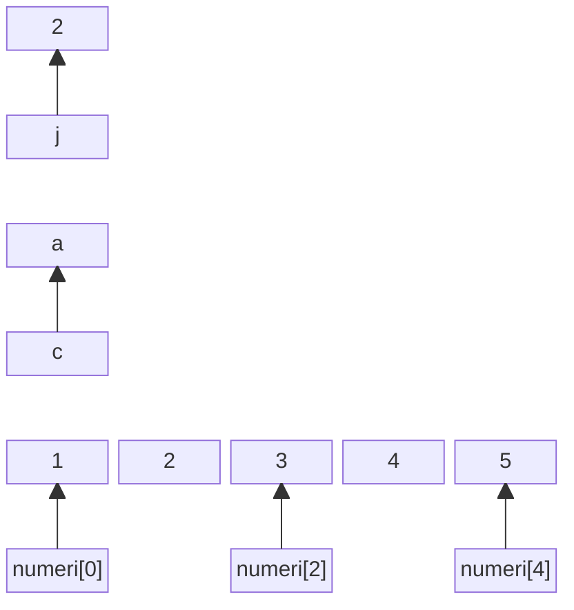
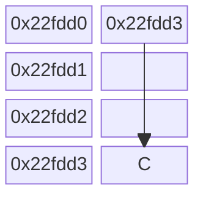
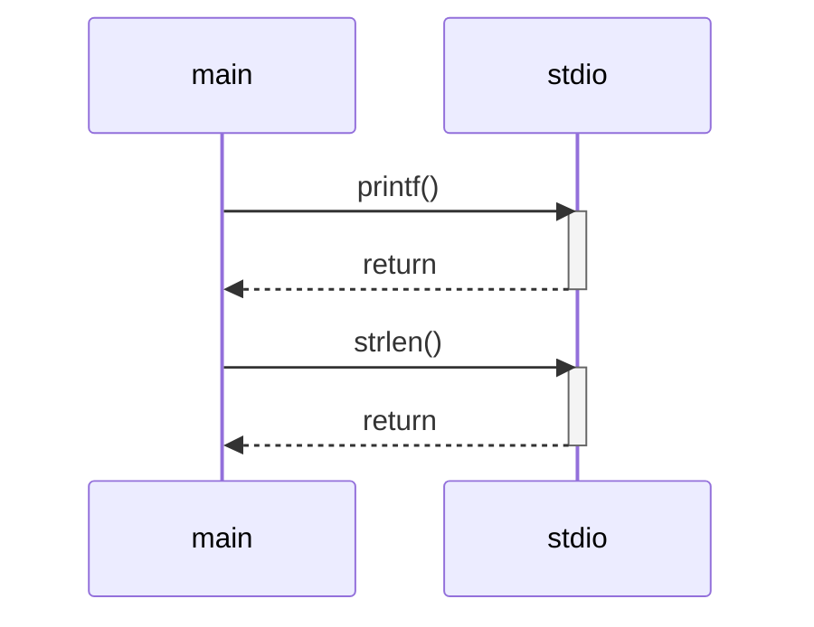
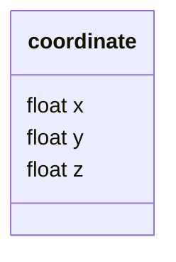

# 4 - Vettori e matrici

Ing. Giancarlo Degani

---
level: 3

---

# Soluzione es. carrello

<<< @/snippets/example04/main.c#sample c {*}{lines:true,maxHeight:'400px'}

---
title: output carrello

level: 3

---

```txt
Inserisci il numero di oggetti nel carrello: 12
Inserisci il prezzo unitario degli oggetti: 1000

===== Dettaglio del Carrello =====
Numero di oggetti: 12
Prezzo unitario: 1000.00
Totale prima dello sconto: 12000.00
Sconto applicato: 1200.00
Imponibile (dopo sconto): 10800.00
IVA (22%): 2376.00
Totale lordo: 13176.00
==============================

```

---
level: 3

---

# Soluzione es. radice

<<< @/snippets/example05/main.c#snippet c {*}{lines:true,maxHeight:'400px'}

---
title: output radice

level: 3

---

```txt
Inserisci un numero maggiore di 1: 5
Punto medio: 3.0000000
Punto medio: 2.0000000
Punto medio: 2.5000000
Punto medio: 2.2500000
Punto medio: 2.1250000
Punto medio: 2.1875000
Punto medio: 2.2187500
Punto medio: 2.2360535
Punto medio: 2.2360687
Punto medio: 2.2360611
Punto medio: 2.2360649
Punto medio: 2.2360668
Punto medio: 2.2360678
Punto medio: 2.2360682
Punto medio: 2.2360680
Punto medio: 2.2360679
Punto medio: 2.2360680
La radice quadrata approssimata di 5.0 è: 2.2360680
```

---
level: 3

---

# Vettori

- Variabile Scalare: contiene 1 singolo valore:

```c
tipo identificatore = valore;
int numero = 3 ;
```

- Variabili vettoriali: contengono più valori dello stesso tipo:

```c
tipo identificatore [ dimensione ] = valore;
int numeri[ 3 ] = { 0, 1, 2 };
```

- **dimensione** deve essere una costante intera, positiva, e nota al momento della compilazione
- Contengono elementi dello stesso tipo scalare ( int, double, char,… )
- L'indici e di tipo intero e non negativo
- Il primo elemento ha indice 0 (posizione)
- L'ultimo elemento ha indice N-1 ( N è la dimensione del vettore )

---
level: 3

---

# Vettori

- Gli elementi del vettore sono allocati in locazioni di memoria
contigue e successive
- Si accede ai singoli elementi indicando il nome del vettore seguito dall'indice fra parentesi quadre
- Poiché ciascun elemento del vettore è del tipo indicato nella definizione, può essere utilizzato in tutti i contesti in cui si può usare una variabile di quel tipo

<Transform :scale="1.3" >
```c
int vett[10];
scanf("%d", &vett[4]);
x = vett[4] * 5;
```

</Transform>

---
layout: two-cols

level: 3

---

# Esempi

- Valori scalari

```c
int j = 2
char c = ‘a’
```

- vettore di 5 elementi

```c
int numeri[5]= {1,2,3,4,5}
```

::right::



---
layout: two-cols

level: 3

---

# Vettori

- I vettori possono essere attraversati agevolmente mediante un ciclo **for**
- Il nome di un vettore è usato dal compilatore come sinonimo dell’indirizzo di memoria del primo elemento del vettore
- Si “sfora” il vettore quando si accede a elementi oltre i limiti del vettore

::right::
<br>
<br>
<Transform :scale="1.3" >

```c
#define N 10
int vett[N];
for (i=0; i<N; i++){
  scanf("%d", &vett[i]);
}
for (i=N-1; i>=0; i--){
  printf("%d\n", vett[i]);
}

```

</Transform>

---
level: 3

---

# Esercizi

- Scrivere un programma che chieda quanti valori verranno introdotti dalla tastiera (max 100), li chieda tutti e successivamente visualizzi prima tutti i valori pari nell’ordine in cui sono stati inseriti e poi tutti i valori dispari nell’ordine inverso. *(see example07)*
- Scrivere un programma che, dati in input N numeri reali, con N che al massimo vale 100, stampi quanti di essi sono maggiori della media e successivamente li stampi a video

---
layout: figure-side

figureUrl: "/Sieve_of_Eratosthenes_animation.gif"

figureCaption: "source: wikipedia.org"

level: 3

---

# Il crivello di Eratostene

Il crivello di [Eratostene](https://it.wikipedia.org/wiki/Crivello_di_Eratostene) è un metodo che consente di trovare i numeri primi fino ad un certo n prefissato.

- si scrivono tutti i numeri naturali a partire da 2 fino n
- si cancellano tutti i multipli del primo numero
- si passa al successivo numero non cancellato e si ripete l'operazione con i numeri che seguono

---
level: 3

---

# Esercizio

Scrivere un programma che richieda un numero n positivo e, usando il crivello di Eratostene, trovi e stampi i numeri primi minori o uguali a n *(see example08)*.

---
level: 3

---

# Soluzione crivello di Eratostene

<<< @/snippets/example08/main.c c {*}{lines:true,maxHeight:'400px'}

---
level: 3

---

# Matrici

- Sono variabili vettoriali con due dimensioni
- Definizione

```c
tipo identificatore [ numero_righe ] [ numero_colonne ] ;
```

- Es: matrice con 10 righe e 20 colonne:

```c
int matrice [ 10 ] [ 20 ];
```

- Gli indici di riga e colonna vanno da 0 a N-1, dove N è la dimensione
- Matrice con 5 righe ( da 0 a 4) e 10 colonne (da 0 a 9)

```c
int matrice [ 5 ][ 10 ];
```

---
level: 3

---

# Matrici

Come per i vettori, il ciclo **for** si presta per attraversare righe e colonne:

<Transform :scale="1.3">
```c
int matrice[RIGHE][COLONNE];
for (r=0; r<RIGHE; r++)
{
    for (c=0; c<COLONNE; c++)
        printf("%d ", matrice[r][c]);
    printf("\n");
}
```
</Transform>

---
layout: two-cols

level: 3

---

# Matrici

- Le matrici sono memorizzate in un’area di memoria contigua per righe
- La matrice m\[10\]\[20\] è memorizzata come 20 vettori consecutivi di 10 elementi
- Un vettore o una matrice possono essere inizializzati elencando i valori delle singole celle della matrice o del vettore

::right::

<br>
<Transform :scale="1.3">

```c
int matrice [2][3] = {1,2,3,4,5,6};
```

</Transform>
<br>

||**0**|**1**|**2**|
|---|---|---|---|
|**0**|1|2|3|
|**1**|4|5|6|

---
level: 3

---

# Matrici

- Non c'è limite al numero delle dimensioni

```c
int matrice [DIM_1][DIM_2]...[DIM_N] ;
```

- Solitamente si usano costanti simboliche ( #define ) per definire le dimensioni dei vettori o delle matrici
- Non è possibile copiare o confrontare due
generici vettori (multidimensionali) usando gli
operatori = o == sui nomi dei vettori stessi

---
level: 3

---

# Caratteri

- Per memorizzare i simboli grafici corrispondenti ai caratteri bisogna associare
un numero intero a ciascuno di essi
- Lo standard ASCII definisce una codifica a 7 o 8 bit
- I caratteri ASCII sono gestiti in C con variabili di tipo **char**. ovvero numeri interi ad 8 bit
- Esempio:
<Transform :scale="1.5">

```c

char character;
char character = 'A'; // assegnazione con caratter
char character = 65;  // assegnazione con codice ASCI decimale
char character = 0x41;  // assegnazione con codice ASCI esadecimale
```

</Transform>

---
level: 3

---

# Caratteri

- Caratteri "speciali" sono rappresentati con le sequenze di escape, ovvero premettendo il carattere '\\':
  - \'
  - \"
  - \\?
  - \\\\

- Alcuni caratteri di controllo
  - \\n - nuova linea
  - \\r - ritorno a capo
  - \\t - tabulazione

---
level: 3

---

# Stringhe

- Sono vettori di **char**  terminate dal carattere **null**
- Null è un carattere speciale rappresentato con **\\0** (Ottale) o **Ox00** (Esadecimale)
- Attenzione:

|Simbolo|Decimale|Esadecimale|
|---|---|---|
|Null|0|0x00|
|'0' (zero)|48|0x30|

---
level: 3

---

# Stringhe

- Poiché le stringhe sono terminate da null, una stringa di n caratteri, richiede n+1 byte di memoria.

Esempio:

|||||||||
|---|---|---|---|---|---|---|---|
|**Char**|H|e|l|l|o|!|**\0**|
|**Dec**|72|101|108|108|111|33|**0**|
|**Hex**|48|65|6C|6C|6F|21|**0**|

---
level: 3

---

# Stringhe

## Costanti

Le stringhe costanti (string literal) sono sequenze di char racchiuse da doppi apici
Esempi:

- "Ciao"
- "Hello World!"

<br>

## Variabili

- Le stringhe variabili sono vettori di char di dimensione nota al momento della compilazione.
- il vettore deve contenere anche il terminatore null.

---
level: 3

---

# Stringhe variabili

- Inizializzazione

<Transform :scale="1.4">
```c
#define MAX_LENGHT 100
char str[100] = “Hello”;
char str[MAX_LENGHT+1] = {‘H’,’e’,’l’,’l’,’o’} ;
```
</Transform>
<br>

- La dimensione massima viene solitamente gestita con #define
- La lunghezza della stringa è data dal numero di caratteri fino al null escluso
- La stringa è un vettore, posso quindi usare la notazione dei vettori per accedere ai singoli caratteri
  - str[0] è il primo carattere
  - str[1] è il secondo carattere

---
level: 3

---

# Stringhe variabili

- Attenzione agli apici:
  - 'a' è un carattere che occupa 1 byte
  - "a" è una stringa di 2 char, il caratter 'a' ed il terminatore \0
- Come per i vettori, il nome della stringa rappresenta per il compilatore una variabile contenente l'indirizzo di memoria del primo carattere della stringa.
- Una stringa non può essere copiata con l'operatore '=', devo usare delle funzioni apposite.

---
level: 3

---

# I/O di stringhe

## puts(nome_stringa)

Visualizza *nome_stringa* e aggiunge un '\n' alla fine.

## gets(nome_stringa)

Legge da tastiera tutta la stringa in input fino al ritorno a capo incluso , la mette in *nome_stringa* senza il '\n' ed aggiunge '\0' alla fine.

## printf("%s", nome_stringa)

%s visualizza la stringa *nome_stringa* fino al '\0'

---
layout: figure

figureCaption: "source: cpprefence.com"

figureUrl: /string_ctype.png

level: 3

---

# Stringhe - ctype.h

---
layout: figure

figureCaption: "source: cpprefence.com"

figureUrl: /string_string1.png

level: 3

---

# Stringhe - string.h

---
level: 3

---



---
level: 3

---



---
level: 3

---

# Esercizi stringhe

<Transform :scale='0.7' >
<<< @/snippets/example09/main.c c {*}{lines:true}
</Transform>

---
level: 3

---

# Esercizi stringhe

<Transform :scale='0.5' >
<<< @/snippets/example10/main.c c {*}{lines:true}
</Transform>

---
level: 3

---

# Esempio 11

<Transform :scale='0.9' >
<<< @/snippets/example11/main.c c {*}{lines:true}
</Transform>
---
level: 3

---

# Esempio 12

<Transform :scale='0.4' >
<<< @/snippets/example12/main.c c {*}{lines:true}
</Transform>

---
level: 3

---

# funzione

```c

float areaTriangolo( float base, float altezza) {
  float risultato = base * altezza / 2 ;
  return risultato ;
}

```

---
level: 3

---

# Esempio 14

<Transform :scale='0.4' >
<<< @/snippets/example14/utility.h c {*}{lines:true}
</Transform>

<Transform :scale='0.4' >
<<< @/snippets/example14/utility.c c {*}{lines:true}
</Transform>

---
level: 3

---

# Esempio 14

<Transform :scale='0.4' >
<<< @/snippets/example14/main.c c {*}{lines:true}
</Transform>

---
level: 3

---

# struct

```c
struct coordinate {
  float x;
  float y;
  float z;
};

    struct coordinate punto1, punto2, *punto3;
    struct coordinate punto4 = {1.0, 2.2, 3.4};

    punto2.x = punto4.x;
    punto2.y = punto4.y;

    (*punto3).x = punto4.x;
    punto3->x = punto4.x;

```



---
level: 3

---

# typedef

```c
   typedef struct record {
        char nome[20];
        char cognome[20];
        int eta;
    } record_utente;

    record_utente utente1, utente2;

    utente1.eta = 20;
    strcpy(utente1.nome, "Mario");

```

---
level: 3

---

# Esempio 15

<Transform :scale='0.4' >
<<< @/snippets/example15/main.c c {*}{lines:true}
</Transform>

---
level: 3

---

# struct

```c {*}{lines:true}
   typedef struct record {
        char nome[20];
        char cognome[20];
        int eta;
    } record_utente ;

record_utente utenti[10] ={ {"bilbo", "baggins", 100 }};


struct record {
        char nome[20];
        char cognome[20];
        int eta;
} utente1, utente2;

if ( utente1.eta == utente2.eta
      && strcmp(utente1.nome, utente2.nome) == 0
      && strcmp(utente1.cognome, utente2.cognome) == 0 ) {
        // code block

}

```

---
level: 3

---

# file

```c {*}{lines:true}

// stdio.h
typedef	struct __sFILE {
 ...
} FILE;

FILE *my_file;

```

---
level: 3

---

# Esempio file

<Transform :scale='0.4' >
<<< @/snippets/example18/main.c c {*}{lines:true}
</Transform>

---
level: 3

---

# struct & func

<Transform :scale='0.9' >
<<< @/snippets/example19/main.c c {*}{lines:true}
</Transform>

---
level: 3

---

# files

<Transform :scale='0.9' >
<<< @/snippets/example20/input.txt csv {*}{lines:true}
</Transform>
<Transform :scale='0.9' >
<<< @/snippets/example20/output.txt csv {*}{lines:true}
</Transform>

---
level: 3

---

# files

<Transform :scale='0.5' >
<<< @/snippets/example20/main.c c {*}{lines:true}
</Transform>
