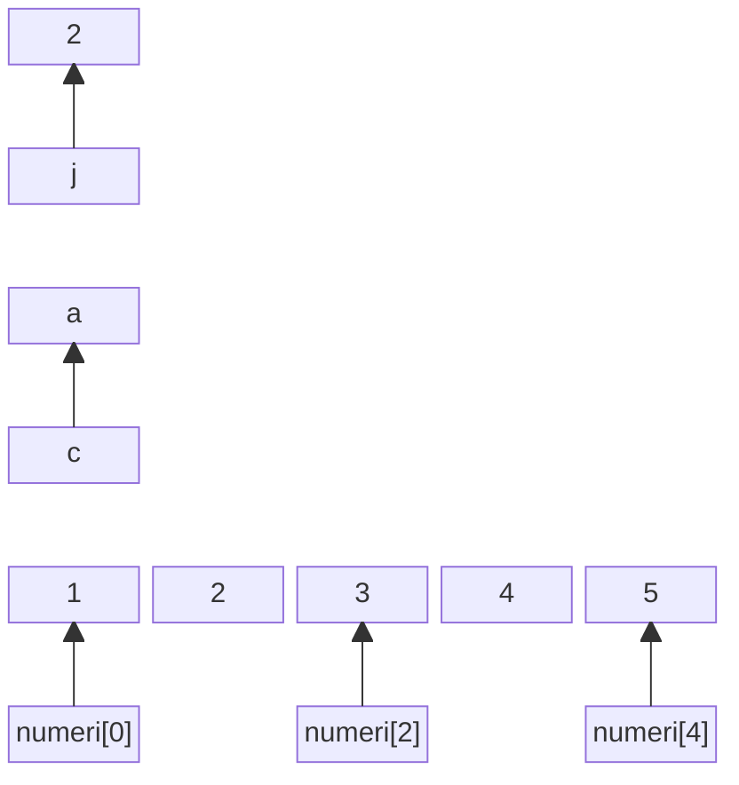

# 4 - Vettori, Matrici e Stringhe

Ing. Giancarlo Degani

---

# Perché abbiamo bisogno dei vettori?

Immaginiamo di dover gestire i voti di 100 studenti:

```c
// ❌ Senza vettori - IMPRATICABILE!
int voto1, voto2, voto3, voto4, voto5, voto6, voto7, voto8, voto9, voto10;
int voto11, voto12, voto13, voto14, voto15, voto16, voto17, voto18, voto19, voto20;
// ... altre 80 variabili!

// Calcolare la media?
float media = (voto1 + voto2 + voto3 + ... + voto100) / 100;  // ❌ Impraticabile!
```

**Problema**: Impossibile gestire grandi quantità di dati dello stesso tipo!

---

# La soluzione: Vettori (Arrays)

```c
// ✅ Con i vettori - SEMPLICE!
int voti[100];

// Lettura dei voti
for (int i = 0; i < 100; i++) {
    printf("Inserisci voto studente %d: ", i + 1);
    scanf("%d", &voti[i]);
}

// Calcolo della media
int somma = 0;
for (int i = 0; i < 100; i++) {
    somma += voti[i];
}
float media = somma / 100.0;
```

**Soluzione**: Un solo nome per gestire molti valori dello stesso tipo!

---

# Vettori

- Variabile Scalare: contiene 1 singolo valore:

```c
tipo identificatore = valore;
int numero = 3 ;
```

- Variabili vettoriali: contengono più valori dello stesso tipo:

```c
tipo identificatore [ dimensione ] = valore;
int numeri[ 3 ] = { 0, 1, 2 };
```

- **dimensione** deve essere una costante intera, positiva, e nota al momento della compilazione
- Contengono elementi dello stesso tipo scalare ( int, double, char,… )
- L'indice è di tipo intero e non negativo
- Il primo elemento ha indice 0 (posizione)
- L'ultimo elemento ha indice N-1 ( N è la dimensione del vettore )

---

# Vettori

- Gli elementi del vettore sono allocati in locazioni di memoria
contigue e successive
- Si accede ai singoli elementi indicando il nome del vettore seguito dall'indice fra parentesi quadre
- Poiché ciascun elemento del vettore è del tipo indicato nella definizione, può essere utilizzato in tutti i contesti in cui si può usare una variabile di quel tipo

<Transform :scale="1.3" >
```c
int vett[10];
scanf("%d", &vett[4]);
x = vett[4] * 5;
```

</Transform>

---
layout: two-cols

---

# Esempi

- Valori scalari

```c
int j = 2
char c = ‘a’
```

- vettore di 5 elementi

```c
int numeri[5]= {1,2,3,4,5}
```

::right::



---
layout: two-cols

---

# Vettori

- I vettori possono essere attraversati agevolmente mediante un ciclo **for**
- Il nome di un vettore è usato dal compilatore come sinonimo dell’indirizzo di memoria del primo elemento del vettore
- Si “sfora” il vettore quando si accede a elementi oltre i limiti del vettore

::right::
<br>
<br>
<Transform :scale="1.3" >

```c
#define N 10
int vett[N];
for (i=0; i<N; i++){
  scanf("%d", &vett[i]);
}
for (i=N-1; i>=0; i--){
  printf("%d\n", vett[i]);
}

```

</Transform>

---

# Operazioni comuni con i vettori

## Trovare il valore massimo

```c
int numeri[5] = {3, 7, 2, 9, 4};
int max = numeri[0];  // Assume the first is max

for (int i = 1; i < 5; i++) {
    if (numeri[i] > max) {
        max = numeri[i];
    }
}
printf("Massimo: %d\n", max);  // Output: 9
```

---

# Operazioni comuni con i vettori

## Invertire un vettore

```c
int vett[5] = {1, 2, 3, 4, 5};
int temp;

for (int i = 0; i < 5/2; i++) {
    temp = vett[i];
    vett[i] = vett[4 - i];
    vett[4 - i] = temp;
}
// Risultato: {5, 4, 3, 2, 1}
```

---

# Errori comuni con i vettori

## ❌ Errore 1: Accesso fuori dai limiti

```c
int vett[10];
vett[10] = 42;  // ❌ ERRORE! L'ultimo indice è 9, non 10
```

## ❌ Errore 2: Tentare di copiare con =

```c
int a[5] = {1, 2, 3, 4, 5};
int b[5];
b = a;  // ❌ ERRORE! Non si possono copiare array con =
```

**Soluzione**: Usare un ciclo per copiare elemento per elemento

```c
for (int i = 0; i < 5; i++) {
    b[i] = a[i];  // ✅ Corretto
}
```

---

# Errori comuni con i vettori

## ❌ Errore 3: Array non inizializzato

```c
int vett[5];
printf("%d\n", vett[0]);  // ❌ Valore indefinito (garbage)
```

**Soluzione**: Inizializzare sempre gli array

```c
int vett[5] = {0};  // ✅ Tutti gli elementi a 0
```

---

# Esercizi

- Scrivere un programma che chieda quanti valori verranno introdotti dalla tastiera (max 100), li chieda tutti e successivamente visualizzi prima tutti i valori pari nell'ordine in cui sono stati inseriti e poi tutti i valori dispari nell'ordine inverso. *(vedi esempio example07)*
- Scrivere un programma che, dati in input N numeri reali, con N che al massimo vale 100, stampi quanti di essi sono maggiori della media e successivamente li stampi a video

---
layout: figure-side
figureUrl: "/Sieve_of_Eratosthenes_animation.gif"
figureCaption: "source: wikipedia.org"

---

# Il crivello di Eratostene

Il crivello di [Eratostene](https://it.wikipedia.org/wiki/Crivello_di_Eratostene) è un metodo che consente di trovare i numeri primi fino ad un certo n prefissato.

- si scrivono tutti i numeri naturali a partire da 2 fino n
- si cancellano tutti i multipli del primo numero
- si passa al successivo numero non cancellato e si ripete l'operazione con i numeri che seguono

---

# Esercizio

Scrivere un programma che richieda un numero n positivo e, usando il crivello di Eratostene, trovi e stampi i numeri primi minori o uguali a n *(vedi esempio example08)*.

---

# Soluzione crivello di Eratostene

<<< @/snippets/example08/main.c c {*}{lines:true,maxHeight:'400px'}

---

# Matrici

- Sono variabili vettoriali con due dimensioni
- Definizione

```c
tipo identificatore [ numero_righe ] [ numero_colonne ] ;
```

- Es: matrice con 10 righe e 20 colonne:

```c
int matrice [ 10 ] [ 20 ];
```

- Gli indici di riga e colonna vanno da 0 a N-1, dove N è la dimensione
- Matrice con 5 righe ( da 0 a 4) e 10 colonne (da 0 a 9)

```c
int matrice [ 5 ][ 10 ];
```

---

# Matrici

Come per i vettori, il ciclo **for** si presta per attraversare righe e colonne:

<Transform :scale="1.3">
```c
int matrice[RIGHE][COLONNE];
for (r=0; r<RIGHE; r++)
{
    for (c=0; c<COLONNE; c++)
        printf("%d ", matrice[r][c]);
    printf("\n");
}
```
</Transform>

---

# Operazioni con le matrici

## Somma degli elementi di una riga

```c
int matrice[3][4] = {{1, 2, 3, 4}, {5, 6, 7, 8}, {9, 10, 11, 12}};
int riga = 1;  // Seconda riga
int somma = 0;

for (int c = 0; c < 4; c++) {
    somma += matrice[riga][c];
}
printf("Somma riga %d: %d\n", riga, somma);  // Output: 26
```

---

# Operazioni con le matrici

## Trasposta di una matrice

```c
int A[2][3] = {{1, 2, 3}, {4, 5, 6}};
int T[3][2];  // Trasposta: righe e colonne invertite

for (int r = 0; r < 2; r++) {
    for (int c = 0; c < 3; c++) {
        T[c][r] = A[r][c];
    }
}
// T = {{1, 4}, {2, 5}, {3, 6}}
```

---

# Operazioni con le matrici

## Accesso alla diagonale principale

```c
int matrice[3][3] = {{1, 2, 3}, {4, 5, 6}, {7, 8, 9}};
int somma_diag = 0;

for (int i = 0; i < 3; i++) {
    somma_diag += matrice[i][i];  // Elementi sulla diagonale
}
printf("Somma diagonale: %d\n", somma_diag);  // Output: 15 (1+5+9)
```

---
layout: two-cols

---

# Matrici

- Le matrici sono memorizzate in un’area di memoria contigua per righe
- La matrice m\[10\]\[20\] è memorizzata come 20 vettori consecutivi di 10 elementi
- Un vettore o una matrice possono essere inizializzati elencando i valori delle singole celle della matrice o del vettore

::right::

<br>
<Transform :scale="1.3">

```c
int matrice [2][3] = {1,2,3,4,5,6};
```

</Transform>
<br>

||**0**|**1**|**2**|
|---|---|---|---|
|**0**|1|2|3|
|**1**|4|5|6|

---

# Matrici

- Non c'è limite al numero delle dimensioni

```c
int matrice [DIM_1][DIM_2]...[DIM_N] ;
```

- Solitamente si usano costanti simboliche ( #define ) per definire le dimensioni dei vettori o delle matrici
- Non è possibile copiare o confrontare due
generici vettori (multidimensionali) usando gli
operatori = o == sui nomi dei vettori stessi

---

# Caratteri

- Per memorizzare i simboli grafici corrispondenti ai caratteri bisogna associare
un numero intero a ciascuno di essi
- Lo standard ASCII definisce una codifica a 7 o 8 bit
- I caratteri ASCII sono gestiti in C con variabili di tipo **char**. ovvero numeri interi ad 8 bit
- Esempio:
<Transform :scale="1.5">

```c

char character;
char character = 'A'; // assegnazione con carattere
char character = 65;  // assegnazione con codice ASCII decimale
char character = 0x41;  // assegnazione con codice ASCII esadecimale
```

</Transform>

---

# Caratteri

- Caratteri "speciali" sono rappresentati con le sequenze di escape, ovvero premettendo il carattere '\\':
  - \'
  - \"
  - \\?
  - \\\\

- Alcuni caratteri di controllo
  - \\n - nuova linea
  - \\r - ritorno a capo
  - \\t - tabulazione

---

# Stringhe

- Sono vettori di **char**  terminate dal carattere **null**
- Null è un carattere speciale rappresentato con **\\0** (Ottale) o **Ox00** (Esadecimale)
- Attenzione:

|Simbolo|Decimale|Esadecimale|
|---|---|---|
|Null|0|0x00|
|'0' (zero)|48|0x30|

---

# Stringhe

- Poiché le stringhe sono terminate da null, una stringa di n caratteri, richiede n+1 byte di memoria.

Esempio:

|||||||||
|---|---|---|---|---|---|---|---|
|**Char**|H|e|l|l|o|!|**\0**|
|**Dec**|72|101|108|108|111|33|**0**|
|**Hex**|48|65|6C|6C|6F|21|**0**|

---

# Stringhe

## Costanti

Le stringhe costanti (string literal) sono sequenze di char racchiuse da doppi apici
Esempi:

- "Ciao"
- "Hello World!"

<br>

## Variabili

- Le stringhe variabili sono vettori di char di dimensione nota al momento della compilazione.
- il vettore deve contenere anche il terminatore null.

---

# Stringhe variabili

- Inizializzazione

<Transform :scale="1.4">
```c
#define MAX_LENGHT 100
char str[100] = “Hello”;
char str[MAX_LENGHT+1] = {‘H’,’e’,’l’,’l’,’o’} ;
```
</Transform>
<br>

- La dimensione massima viene solitamente gestita con #define
- La lunghezza della stringa è data dal numero di caratteri fino al null escluso
- La stringa è un vettore, posso quindi usare la notazione dei vettori per accedere ai singoli caratteri
  - str\[0\] è il primo carattere
  - str\[1\] è il secondo carattere

---

# Stringhe variabili

- Attenzione agli apici:
  - 'a' è un carattere che occupa 1 byte
  - "a" è una stringa di 2 char, il carattere 'a' ed il terminatore \0
- Come per i vettori, il nome della stringa rappresenta per il compilatore una variabile contenente l'indirizzo di memoria del primo carattere della stringa.
- Una stringa non può essere copiata con l'operatore '=', devo usare delle funzioni apposite.

---

# ⚠️ Sicurezza con le stringhe

## Buffer Overflow

```c
char nome[10];
// ❌ PERICOLO! Se l'utente inserisce più di 9 caratteri
scanf("%s", nome);  // Può sovrascrivere memoria adiacente!
```

**Soluzione**: Limitare sempre la lunghezza

```c
char nome[10];
scanf("%9s", nome);  // ✅ Legge al massimo 9 caratteri + \0
```

---

# ⚠️ Sicurezza con le stringhe

## gets() è deprecata e PERICOLOSA!

```c
char buffer[50];
gets(buffer);  // ❌ VIETATO! Rimosso da C11 per motivi di sicurezza
```

**Problema**: `gets()` non controlla la dimensione del buffer → buffer overflow garantito!

**Soluzione**: Usare `fgets()` invece

```c
char buffer[50];
fgets(buffer, 50, stdin);  // ✅ Sicuro: specifica la dimensione massima
```

---

# ⚠️ Sicurezza con le stringhe

## Funzioni sicure vs non sicure

| ❌ Non sicura | ✅ Alternativa sicura | Motivo |
|--------------|---------------------|---------|
| `gets(s)` | `fgets(s, size, stdin)` | gets() non controlla la dimensione |
| `strcpy(dest, src)` | `strncpy(dest, src, n)` | strcpy() non limita la copia |
| `strcat(dest, src)` | `strncat(dest, src, n)` | strcat() non limita la concatenazione |
| `sprintf(s, fmt, ...)` | `snprintf(s, n, fmt, ...)` | sprintf() non limita l'output |

**Regola d'oro**: Usare sempre le versioni con 'n' che limitano la dimensione!

---

# I/O di stringhe

## puts(nome_stringa)

Visualizza *nome_stringa* e aggiunge un '\n' alla fine.

## gets(nome_stringa)

Legge da tastiera tutta la stringa in input fino al ritorno a capo incluso , la mette in *nome_stringa* senza il '\n' ed aggiunge '\0' alla fine.

## printf("%s", nome_stringa)

%s visualizza la stringa *nome_stringa* fino al '\0'

---
layout: figure
figureCaption: "source: cpprefence.com"
figureUrl: /string_ctype.png

---

# Stringhe - ctype.h

---
layout: figure

figureCaption: "source: cpprefence.com"

figureUrl: /string_string1.png

---

# Stringhe - string.h

---

# Esercizi stringhe

<<< @/snippets/example09/main.c c {*}{lines:true}

---

# Esercizi stringhe

<<< @/snippets/example10/main.c c {*}{lines:true}

---

# Esempio 11: Manipolazione stringhe

<<< @/snippets/example11/main.c c {*}{lines:true}